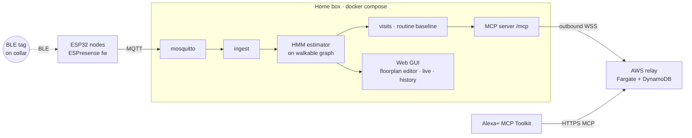

# wheres_allie: Flasher, Judge Mode and Submission Implementation Plan

**Goal:** Let a pet owner turn a blank ESP32 into a working node from the browser (phase 9); let a judge run `docker compose -f deploy/demo.yml up` and see Allie moving, with days of history, within 2 minutes; and ship the Devpost package: CI, README, video, feedback and friction log (phase 10). Phase 11 has optional stretch goals.

**Architecture:**
- **Firmware.** `wheres-allie patch-bootloader` downloads the pinned ESPresense v4.0.6 parts, checks their SHA-256, and patches the bootloader header to dout/20 MHz (recomputing the appended SHA-256). It writes everything to `box/web/public/firmware/`, and the binaries are committed.
- **Flasher.** The web flasher is a React `FlashWizard` built on `esptool-js` (erase and flash) and a small Improv-serial client (Wi-Fi provisioning, which returns the node's URL). Because Web Serial needs a secure context, the wizard runs in two places:
  - inline in `Nodes.tsx` when the GUI is already a secure context (`http://localhost`);
  - otherwise in a standalone `flash.html` published on GitHub Pages (HTTPS). That page hands the node's IP back to the LAN GUI with a top-level navigation. The LAN GUI then calls `POST /api/nodes/{id}/configure` and waits for `node.health` online.
- **Judge mode.** `deploy/demo.yml` runs mosquitto, the box (relay disabled, backfilled from the curated bundle on first start so History has days of data) and a replayer container. The replayer publishes the bundle's final hour as live ESPresense MQTT, time-shifted to "now" and looping.
- **CI.** GitHub Actions run the tests, the estimator-eval gate and a multi-arch GHCR image, and deploy the flasher to Pages.

**Tech Stack:**
- Python 3.12: typer, httpx, aiomqtt, pytest, respx.
- TypeScript: React 18, esptool-js 0.7, Web Serial, vitest, @testing-library/react.
- Docker Compose, GitHub Actions (buildx, GHCR, Pages).
- Stretch only: three.js, and C# (.NET) for the ESPresense-companion PR.

| Task | Description | Status | Tested | Pushed |
|------|-------------|--------|--------|--------|
| 1 | `firmware.py`: ESP32 bootloader header patch + committed real-bootloader fixture | pending | no | no |
| 2 | `firmware.build_firmware` + `wheres-allie patch-bootloader` CLI | pending | no | no |
| 3 | Generate and commit `web/public/firmware/*` | pending | no | no |
| 4 | `web/src/lib/improv.ts`: Improv packet build/parse | pending | no | no |
| 5 | `web/src/lib/improvSession.ts`: provision Wi-Fi over a serial port | pending | no | no |
| 6 | `web/src/lib/flasher.ts`: firmware loader (SHA-checked) + esptool-js flash | pending | no | no |
| 7 | `FlashWizard` component (connect → flash → Wi-Fi → join) with diagnostics | pending | no | no |
| 8 | `flash.html` standalone entry + return-URL guard | pending | no | no |
| 9 | `POST /api/nodes/{id}/configure` (push MQTT settings + restart) | pending | no | no |
| 10 | `AddNodeFlow` in `Nodes.tsx`: secure-context switch, configure, wait online, place | pending | no | no |
| 11 | GitHub Pages workflow for the HTTPS flasher | pending | no | no |
| 12 | Manual hardware checklist (AITRIP board) | pending | no | no |
| 13 | Phase 9 push | pending | no | no |
| 14 | `POST /api/data/export` | pending | no | no |
| 15 | `replay/replayer.py`: schedule + MQTT publisher | pending | no | no |
| 16 | `replay/replayer.py`: `backfill()` seeds home/pets/tags/history into the DB | pending | no | no |
| 17 | CLI `wheres-allie replay` and `wheres-allie demo-seed` | pending | no | no |
| 18 | `deploy/demo.yml` + judge-mode smoke script | pending | no | no |
| 19 | Demo-data curation (manual: export, ground truth, eval, commit) | pending | no | no |
| 20 | CI workflow (box, web, relay, eval gate, multi-arch GHCR image) | pending | no | no |
| 21 | README (judge quickstart, architecture, BOM, setup) | pending | no | no |
| 22 | `docs/submission/`: Devpost description, product feedback, curated friction log | pending | no | no |
| 23 | Demo video shot list + script | pending | no | no |
| 24 | Clean-machine judge-mode rehearsal (manual) | pending | no | no |
| 25 | Phase 10 push | pending | no | no |
| 26 | (optional) Stacked 3D path view outline | pending | no | no |
| 27 | (optional) ESPresense-companion availability PR (Open Source mini-challenge) | pending | no | no |
| 28 | Final push + submission | pending | no | no |

## Interface additions

These add to conventions §1–§13. None of them replaces anything there.

1. **`box/src/wheres_allie/firmware.py`** (new module):
   - `ESPRESENSE_VERSION = "v4.0.6"`.
   - `PARTS: list[tuple[str, int, str, str]]`, with rows of (published name, flash offset, source URL, pinned sha256 of the download).
   - `patch_bootloader(image: bytes, mode: str = "dout", freq: str = "20m") -> bytes`.
   - `build_firmware(out_dir: Path, fetch=None, parts=None) -> dict` returns and writes the manifest.
2. **`box/web/public/firmware/manifest.json`** is our own format, not the ESP Web Tools format: `{name, version, chip: "ESP32", parts: [{path, offset, sha256}]}`. Its `sha256` values are hashes of the files *as published*, so the bootloader entry is the patched hash.
3. **Web modules** (new):
   - `web/src/lib/improv.ts`: packet codec.
   - `web/src/lib/improvSession.ts`: `provisionWifi(port, ssid, password, opts) -> Promise<string>`, which resolves to the node URL `http://<ip>`.
   - `web/src/lib/flasher.ts`: `loadFirmware(base)` and `flashNode(port, files, opts)`.
   - `web/src/components/flasher/FlashWizard.tsx`: `props {onDone({ip, roomId, name}), firmwareBase}`.
   - `web/src/components/flasher/AddNodeFlow.tsx`.
   - `web/flash.html` + `web/src/flash-main.tsx`: a second Vite entry, built to `dist/flash.html`.
4. **Web Serial secure-context decision.** The LAN GUI (`http://wheres-allie.local`) is not a secure context, so `navigator.serial` is `undefined` there.
   - **The canonical flasher is `https://seiraiyu.github.io/wheres_allie/flash.html`.** It is built from the same code and deployed by `.github/workflows/pages.yml`, and it serves the same committed firmware files.
   - `Nodes.tsx` opens it with `?return=<location.origin>`.
   - When the node has joined Wi-Fi, the flasher navigates the tab to `<return>/nodes?add_node_ip=<ip>&room=<room_id>&name=<name>`. This is a top-level https→http navigation, which browsers allow; mixed-content `fetch` would be blocked.
   - `return` is accepted only if its host is `localhost`, `*.local`, or a private IPv4 address (RFC 1918).
   - When the GUI itself is a secure context (for example `http://localhost:8080` on the box's own machine), the wizard runs inline.
   - The Wi-Fi password only ever travels over USB serial to the node. It is never sent to GitHub Pages or to the box.
   - Build-time override: `VITE_FLASHER_URL`.
5. **Improv scan is not available.** ESPresense's `SerialImprov.cpp` implements only RPC 1 (send Wi-Fi), 2 (request state) and 3 (request info), and answers anything else with error 0x02. So the wizard asks for the SSID as text instead of scanning. This deviates from design §4.8 step 3. After RPC 1 the node sends state 0x03 and **reboots**, so the client polls RPC 2 until it gets state 0x04 plus an RPC result carrying `http://<ip>`.
6. **Judge-mode history.**
   - The CLI gains `wheres-allie demo-seed --bundle X --live-hours H`, which calls `replay.replayer.backfill(conn, bundle, live_hours)`. On first start it writes into the DB the bundle's home, pets, tags, readings, motion and labels, excluding the final `H` hours, time-shifted so that the bundle's last `H` hours start "now". It is idempotent through `settings.demo_seeded`.
   - `wheres-allie replay --bundle X --speed N --live-hours H --loop` publishes those final `H` hours over MQTT.
   - Seeding home and pets therefore happens in the box container (it needs the DB), and the replayer container only speaks MQTT.
   - After backfill, positions and visits for the past come from the estimator catch-up (see Task 16).
7. **`.github/workflows/ci.yml`** and **`.github/workflows/pages.yml`**.
   - Image: `ghcr.io/seiraiyu/wheres-allie:{latest,sha}` for linux/amd64 and linux/arm64. `deploy/demo.yml` uses `:latest`.
8. **Demo data.**
   - `demo-data/allie-demo.bundle` (<20 MB).
   - `demo-data/allie-ground-truth.csv`, in the same columns as the bundle's `ground_truth.csv`, used by the CI eval gate.
   - `demo-data/eval-thresholds.json` (`{min_room_acc, min_landmark_acc, max_transit_false_visit_rate, must_beat_baseline}`), read by `box/tools/eval_gate.py`.
   - `deploy/demo-smoke.sh` is the judge-mode acceptance test, run locally and in CI.
9. **`POST /api/nodes/{id}/configure`** (conventions §10; implemented here in Task 9 on plan 01's `nodes.py` router).
   - Body: `{ip: private IPv4, room_id: ^[a-z0-9_]{1,32}$, name}`, and the path `id` must equal `room_id` (otherwise 422).
   - It calls `espresense_http.push_settings(overrides)` then `restart()`, with `overrides = {room, mqtt_host: WA_PUBLIC_HOST or the request host (a 422 if that resolves to localhost), mqtt_port, mqtt_user, mqtt_pass, auto_update: False}`.
   - It upserts `nodes(id, name, ip)` and returns `{id, changed: [keys]}`. A node it can't reach gives a 502, with the node IP in the `detail`.
10. **`POST /api/data/export`** (conventions §10; implemented here in Task 14) returns `wheres-allie-<from>-<to>.bundle`, built with plan 01's `write_bundle`.
11. **`docs/submission/`**: `devpost.md`, `product-feedback.md`, `friction-log.md` (curated; `docs/friction-log.md` stays the raw log), `video.md`.

---

# Phase 9: In-GUI node flasher

### Task 1: ESP32 bootloader header patch

The AITRIP boards boot only when the bootloader's header says flash mode **dout** (byte 2 = `0x03`) and freq **20 MHz** (low nibble of byte 3 = `0x2`; the high nibble, `0x2` = 4 MB, is kept, giving byte 3 = `0x22`).

The ESPresense bootloader has `hash_appended = 1` (byte 23), so the SHA-256 of the image must be recomputed after the patch. It sits in the 32 bytes after the checksum byte. The checksum byte itself covers only segment data, so it doesn't change.

This patch was verified on 2026-09-28: the output passes `esptool image-info` ("Checksum: 0xab (valid)", "Validation hash: … (valid)", "Flash mode: DOUT", "Flash freq: 20m"), and its sha256 is `1813decac015db123137cb1dd9c45162a530f55467b9d61f7be45daa7e72a74b`.

**Files:**
- Create: `box/tests/fixtures/esp32-bootloader-v4.0.6.bin` (the real 15 872-byte ESPresense bootloader)
- Create: `box/src/wheres_allie/firmware.py`
- Test: `box/tests/test_firmware.py`

**Step 1: Write failing test**

First fetch the fixture (committed, so tests never need the network):
```bash
cd box
curl -sSfL -o tests/fixtures/esp32-bootloader-v4.0.6.bin https://espresense.com/static/esp32/bootloader.bin
sha256sum tests/fixtures/esp32-bootloader-v4.0.6.bin
# expect 055287d392bb0648ffa4eed623cda311bdbc67241b39ff01ebe675243f98077e, 15872 bytes
```

`box/tests/test_firmware.py`:
```python
import hashlib
from pathlib import Path

import pytest

from wheres_allie.firmware import patch_bootloader

FIXTURE = Path(__file__).parent / "fixtures" / "esp32-bootloader-v4.0.6.bin"
PATCHED_SHA = "1813decac015db123137cb1dd9c45162a530f55467b9d61f7be45daa7e72a74b"  # esptool-verified


def test_patch_sets_dout_20m_and_keeps_size():
    orig = FIXTURE.read_bytes()
    assert orig[2:4] == b"\x02\x20"  # dio, 4MB/40MHz as shipped
    out = patch_bootloader(orig)
    assert out[2] == 0x03 and out[3] == 0x22
    assert len(out) == len(orig)


def test_patch_recomputes_appended_sha256():
    out = patch_bootloader(FIXTURE.read_bytes())
    end = 15840  # 24-byte header + segments, padded so the checksum is the last byte of a 16-byte block
    assert out[end:end + 32] == hashlib.sha256(out[:end]).digest()
    assert hashlib.sha256(out).hexdigest() == PATCHED_SHA


def test_patch_is_idempotent_and_leaves_checksum():
    orig = FIXTURE.read_bytes()
    once = patch_bootloader(orig)
    assert patch_bootloader(once) == once
    assert once[15839] == orig[15839]  # checksum covers segment data only


def test_rejects_non_image():
    with pytest.raises(ValueError, match="magic"):
        patch_bootloader(b"\x00" * 64)
```

**Step 2: Run test, verify failure**
```bash
cd box && uv run pytest tests/test_firmware.py -q
```
Expected: `ModuleNotFoundError: No module named 'wheres_allie.firmware'`.

**Step 3: Implement** `box/src/wheres_allie/firmware.py`:
```python
"""ESPresense firmware for the in-GUI flasher, with the AITRIP dout/20 MHz bootloader fix."""

import hashlib
import struct

FLASH_MODES = {"qio": 0, "qout": 1, "dio": 2, "dout": 3}
FLASH_FREQS = {"40m": 0x0, "26m": 0x1, "20m": 0x2, "80m": 0xF}


def patch_bootloader(image: bytes, mode: str = "dout", freq: str = "20m") -> bytes:
    """Rewrite an ESP32 image header's flash mode/freq (as `esptool --flash-mode --flash-freq`
    does) and recompute the appended SHA-256 so the ROM still accepts it."""
    d = bytearray(image)
    if len(d) < 24 or d[0] != 0xE9:
        raise ValueError("not an ESP32 image (magic != 0xE9)")
    off = 24  # 8-byte header + 16-byte extended header
    for _ in range(d[1]):
        _load_addr, length = struct.unpack_from("<II", d, off)
        off += 8 + length
    end = (off // 16 + 1) * 16  # checksum byte is padded to the last byte of a 16-byte block
    if end > len(d):
        raise ValueError("truncated ESP32 image")
    d[2] = FLASH_MODES[mode]
    d[3] = (d[3] & 0xF0) | FLASH_FREQS[freq]  # keep the flash-size nibble
    if d[23] == 1:  # hash_appended
        if len(d) < end + 32:
            raise ValueError("hash_appended set but SHA-256 missing")
        d[end:end + 32] = hashlib.sha256(d[:end]).digest()
    return bytes(d)
```

**Step 4: Run test, verify pass**
```bash
cd box && uv run pytest tests/test_firmware.py -q && uv run ruff check src/wheres_allie/firmware.py
```
Expected: `4 passed`, ruff clean.

**Step 5: Commit**
```bash
git add box/src/wheres_allie/firmware.py box/tests/test_firmware.py box/tests/fixtures/esp32-bootloader-v4.0.6.bin
git commit -m "feat: patch ESP32 bootloader header to dout/20MHz for AITRIP boards

Co-Authored-By: Claude Opus 5.5 <noreply@anthropic.com>"
```

---

### Task 2: `build_firmware` + `wheres-allie patch-bootloader`

**Files:**
- Modify: `box/src/wheres_allie/firmware.py`
- Modify: `box/src/wheres_allie/cli.py` (add a command to the existing typer `app`)
- Test: `box/tests/test_firmware.py` (append)

**Step 1: Write failing test** (append to `box/tests/test_firmware.py`, moving the new imports to the top of the file):
```python
import json

from typer.testing import CliRunner

from wheres_allie import firmware
from wheres_allie.cli import app


def _fake_parts(tmp_path):
    boot = FIXTURE.read_bytes()
    blobs = {"u/boot": boot, "u/part": b"P" * 3072, "u/app0": b"A" * 8192, "u/app": b"E" * 100}
    parts = [
        ("bootloader-dout20m.bin", 0x1000, "u/boot", hashlib.sha256(boot).hexdigest()),
        ("partitions.bin", 0x8000, "u/part", hashlib.sha256(blobs["u/part"]).hexdigest()),
        ("boot_app0.bin", 0xE000, "u/app0", hashlib.sha256(blobs["u/app0"]).hexdigest()),
        ("esp32.bin", 0x10000, "u/app", hashlib.sha256(blobs["u/app"]).hexdigest()),
    ]
    return parts, blobs.__getitem__


def test_build_firmware_writes_patched_parts_and_manifest(tmp_path):
    parts, fetch = _fake_parts(tmp_path)
    m = firmware.build_firmware(tmp_path, fetch=fetch, parts=parts)
    assert [p["offset"] for p in m["parts"]] == [0x1000, 0x8000, 0xE000, 0x10000]
    assert m["parts"][0]["sha256"] == PATCHED_SHA
    assert (tmp_path / "bootloader-dout20m.bin").read_bytes()[2:4] == b"\x03\x22"
    assert json.loads((tmp_path / "manifest.json").read_text()) == m
    assert m["version"] == "v4.0.6" and m["chip"] == "ESP32"


def test_build_firmware_rejects_tampered_download(tmp_path):
    parts, fetch = _fake_parts(tmp_path)
    parts[3] = (*parts[3][:3], "0" * 64)
    with pytest.raises(ValueError, match="sha256"):
        firmware.build_firmware(tmp_path, fetch=fetch, parts=parts)
    assert not (tmp_path / "manifest.json").exists()


def test_cli_patch_bootloader(tmp_path, monkeypatch):
    parts, fetch = _fake_parts(tmp_path)
    monkeypatch.setattr(firmware, "PARTS", parts)
    monkeypatch.setattr(firmware, "_download", fetch)
    res = CliRunner().invoke(app, ["patch-bootloader", "--out", str(tmp_path / "fw")])
    assert res.exit_code == 0, res.output
    assert "0x01000 bootloader-dout20m.bin" in res.output
    assert (tmp_path / "fw" / "manifest.json").exists()
```

**Step 2: Run test, verify failure**
```bash
cd box && uv run pytest tests/test_firmware.py -q
```
Expected: `AttributeError: module 'wheres_allie.firmware' has no attribute 'build_firmware'`.

**Step 3: Implement.** Append to `box/src/wheres_allie/firmware.py` (and add `import json`, `from pathlib import Path`, `import httpx` at the top):
```python
ESPRESENSE_VERSION = "v4.0.6"
# (published name, flash offset, source url, sha256 of the unmodified download), from
# https://espresense.com/releases/v4.0.6.json?flavor=esp32
PARTS = [
    ("bootloader-dout20m.bin", 0x1000, "https://espresense.com/static/esp32/bootloader.bin",
     "055287d392bb0648ffa4eed623cda311bdbc67241b39ff01ebe675243f98077e"),
    ("partitions.bin", 0x8000, "https://espresense.com/static/esp32/partitions.bin",
     "75ad18c4b7f172345f99cdd626411b2365e39e8592c602fccdb3f52b74f486b8"),
    ("boot_app0.bin", 0xE000, "https://espresense.com/static/boot_app0.bin",
     "f94c5d786a7a8fab06ac5d10e33bf37711a6697636dc037559ea19cc410a17f0"),
    ("esp32.bin", 0x10000,
     f"https://github.com/ESPresense/ESPresense/releases/download/{ESPRESENSE_VERSION}/esp32.bin",
     "60bf4b9ede8f856850f4b34a98bb2d719d05e324f9b6f89aeb01d8d2988ee138"),
]
BOOTLOADER_OFFSET = 0x1000


def _download(url: str) -> bytes:
    r = httpx.get(url, follow_redirects=True, timeout=60)
    r.raise_for_status()
    return r.content


def build_firmware(out_dir: Path, fetch=None, parts=None) -> dict:
    """Download + verify every part, patch the bootloader, write parts and manifest.json."""
    fetch = fetch or _download
    blobs = []
    for name, offset, url, sha in parts or PARTS:
        data = fetch(url)
        got = hashlib.sha256(data).hexdigest()
        if got != sha:
            raise ValueError(f"{url}: sha256 {got} != pinned {sha}")
        blobs.append((name, offset, patch_bootloader(data) if offset == BOOTLOADER_OFFSET else data))
    out_dir.mkdir(parents=True, exist_ok=True)
    manifest = {
        "name": f"ESPresense {ESPRESENSE_VERSION} (ESP32, dout/20MHz bootloader)",
        "version": ESPRESENSE_VERSION,
        "chip": "ESP32",
        "parts": [],
    }
    for name, offset, data in blobs:
        (out_dir / name).write_bytes(data)
        manifest["parts"].append(
            {"path": name, "offset": offset, "sha256": hashlib.sha256(data).hexdigest()})
    (out_dir / "manifest.json").write_text(json.dumps(manifest, indent=2) + "\n")
    return manifest
```
Add to `box/src/wheres_allie/cli.py` (with `from pathlib import Path`, `from typing import Annotated` and `from wheres_allie import firmware` at the top):
```python
@app.command("patch-bootloader")
def patch_bootloader_cmd(
    out: Annotated[Path, typer.Option(help="Output dir")] = Path("web/public/firmware"),
):
    """Download ESPresense v4.0.6, patch the bootloader to dout/20MHz, write flasher assets."""
    manifest = firmware.build_firmware(out)
    for p in manifest["parts"]:
        typer.echo(f"{p['offset']:#07x} {p['path']} {p['sha256'][:12]}")
```

**Step 4: Run test, verify pass**
```bash
cd box && uv run pytest tests/test_firmware.py -q && uv run ruff check src tests
```
Expected: `7 passed`, ruff clean.

**Step 5: Commit**
```bash
git add box/src/wheres_allie/firmware.py box/src/wheres_allie/cli.py box/tests/test_firmware.py
git commit -m "feat: add patch-bootloader CLI that builds pinned flasher firmware

Co-Authored-By: Claude Opus 5.5 <noreply@anthropic.com>"
```

---

### Task 3: Generate and commit the flasher firmware

**Files:** Create `box/web/public/firmware/{bootloader-dout20m.bin,partitions.bin,boot_app0.bin,esp32.bin,manifest.json}`. This is a manual command step with no new code.

1. Build the firmware:
   ```bash
   cd box && uv run wheres-allie patch-bootloader
   ```
   Expected output (4 lines):
   ```
   0x01000 bootloader-dout20m.bin 1813decac015
   0x08000 partitions.bin 75ad18c4b7f1
   0x0e000 boot_app0.bin f94c5d786a7a
   0x10000 esp32.bin 60bf4b9ede8f
   ```
2. Validate the patched bootloader independently:
   ```bash
   uvx esptool image-info web/public/firmware/bootloader-dout20m.bin | grep -E "Flash (mode|freq)|valid"
   ```
   Expected: `Flash freq: 20m`, `Flash mode: DOUT`, `Checksum: 0xab (valid)` and `Validation hash: … (valid)`.
3. Check the files aren't gitignored (the root `.gitignore` has `firmware/*.bin`, which is anchored to `/firmware/`):
   ```bash
   git check-ignore -v box/web/public/firmware/esp32.bin || echo "not ignored"
   ```
   Expected: `not ignored`.
4. Commit (about 1.3 MB in total):
   ```bash
   git add box/web/public/firmware
   git commit -m "chore: commit ESPresense v4.0.6 flasher firmware with dout/20MHz bootloader

   Co-Authored-By: Claude Opus 5.5 <noreply@anthropic.com>"
   ```

---

### Task 4: Improv serial packet codec

The protocol follows ESPresense `main/SerialImprov*.cpp`:
- A frame is `"IMPROV"`, then version `1`, type, length, data, checksum. The checksum is the sum of all preceding bytes, mod 256.
- Types: 1 = current state, 2 = error state, 3 = RPC command, 4 = RPC result.
- RPC data is `cmd, dataLen, (len, bytes)*`.
- The node's writes are interleaved with log text and followed by `\n`, so the parser must resync on garbage.

Test vectors were computed on 2026-09-28 and match the C++ builders.

**Files:**
- Create: `box/web/src/lib/improv.ts`
- Test: `box/web/src/lib/improv.test.ts`

**Step 1: Write failing test** `box/web/src/lib/improv.test.ts`:
```ts
import { describe, expect, it } from "vitest";
import { buildRpc, ImprovParser, parseRpcResult, PacketType, Rpc, wifiPacket } from "./improv";

const hex = (s: string) => Uint8Array.from(s.split(" ").map((b) => parseInt(b, 16)));
const text = (s: string) => new TextEncoder().encode(s);

describe("improv codec", () => {
  it("builds REQUEST_STATE", () => {
    expect(buildRpc(Rpc.RequestState)).toEqual(hex("49 4d 50 52 4f 56 01 03 02 02 00 e5"));
  });

  it("builds SEND_WIFI like the ESPresense decoder expects", () => {
    expect(wifiPacket("HomeNet", "pw123456")).toEqual(
      hex("49 4d 50 52 4f 56 01 03 13 01 11 07 48 6f 6d 65 4e 65 74 08 70 77 31 32 33 34 35 36 e1"),
    );
  });

  it("rejects SSIDs/passwords the node cannot store", () => {
    expect(() => wifiPacket("", "x")).toThrow(/network name/);
    expect(() => wifiPacket("a".repeat(33), "x")).toThrow(/network name/);
    expect(() => wifiPacket("ok", "p".repeat(64))).toThrow(/password/);
  });

  it("parses packets split across chunks and mixed with log text", () => {
    const state = hex("49 4d 50 52 4f 56 01 01 01 04 e4");
    const rpc = hex(
      "49 4d 50 52 4f 56 01 04 16 02 14 13 68 74 74 70 3a 2f 2f 31 39 32 2e 31 36 38 2e 31 2e 35 30 d4",
    );
    const p = new ImprovParser();
    expect(p.push(text("[Improv] State 4\nIMPR"))).toEqual([]); // log text + partial header
    const got = [
      ...p.push(Uint8Array.from([...state.slice(4), 0x0a, ...rpc.slice(0, 10)])),
      ...p.push(Uint8Array.from([...rpc.slice(10), 0x0a])),
    ];
    // "IMPR" + state.slice(4) reassembles the state packet
    expect(got.map((g) => g.type)).toEqual([PacketType.CurrentState, PacketType.RpcResult]);
    expect(got[0].data).toEqual(Uint8Array.of(4));
    expect(parseRpcResult(got[1].data)).toEqual({ command: 2, strings: ["http://192.168.1.50"] });
  });

  it("skips a frame with a bad checksum and resyncs", () => {
    const bad = hex("49 4d 50 52 4f 56 01 01 01 04 00");
    const good = hex("49 4d 50 52 4f 56 01 01 01 03 e3");
    const got = new ImprovParser().push(Uint8Array.from([...bad, ...good]));
    expect(got).toEqual([{ type: PacketType.CurrentState, data: Uint8Array.of(3) }]);
  });
});
```

**Step 2: Run test, verify failure**
```bash
cd box/web && pnpm vitest run src/lib/improv.test.ts
```
Expected: fails because `./improv` can't be resolved.

**Step 3: Implement** `box/web/src/lib/improv.ts`:
```ts
// Improv serial v1 (https://www.improv-wifi.com/serial/) as implemented by ESPresense
// main/SerialImprov.cpp. ESPresense supports only SEND_WIFI, REQUEST_STATE, REQUEST_INFO (no scan).
const HEADER = [0x49, 0x4d, 0x50, 0x52, 0x4f, 0x56]; // "IMPROV"

export const PacketType = { CurrentState: 1, ErrorState: 2, RpcCommand: 3, RpcResult: 4 } as const;
export const Rpc = { SendWifi: 1, RequestState: 2, RequestInfo: 3 } as const;
export const State = { Authorized: 2, Provisioning: 3, Provisioned: 4 } as const;
export const ImprovError: Record<number, string> = {
  1: "The node rejected a malformed Improv packet.",
  2: "The node didn't understand the Improv command.",
  3: "The node couldn't connect to that Wi-Fi network.",
  255: "The node reported an unknown Improv error.",
};

export type ImprovPacket = { type: number; data: Uint8Array };

const sum = (bytes: ArrayLike<number>, n: number) => {
  let s = 0;
  for (let i = 0; i < n; i++) s += bytes[i];
  return s & 0xff;
};

export function buildRpc(command: number, strings: string[] = []): Uint8Array {
  const parts = strings.map((s) => new TextEncoder().encode(s));
  const payload = parts.reduce((n, p) => n + 1 + p.length, 0);
  const out = new Uint8Array(12 + payload);
  out.set(HEADER, 0);
  out[6] = 1; // version
  out[7] = PacketType.RpcCommand;
  out[8] = 2 + payload;
  out[9] = command;
  out[10] = payload;
  let i = 11;
  for (const p of parts) {
    out[i++] = p.length;
    out.set(p, i);
    i += p.length;
  }
  out[i] = sum(out, i);
  return out;
}

export function wifiPacket(ssid: string, password: string): Uint8Array {
  const n = (s: string) => new TextEncoder().encode(s).length;
  if (n(ssid) < 1 || n(ssid) > 32) throw new Error("Wi-Fi network name must be 1-32 bytes.");
  if (n(password) > 63) throw new Error("Wi-Fi password must be at most 63 characters.");
  return buildRpc(Rpc.SendWifi, [ssid, password]);
}

export function parseRpcResult(data: Uint8Array): { command: number; strings: string[] } {
  const strings: string[] = [];
  let i = 2;
  while (i < 2 + data[1] && i < data.length) {
    const len = data[i++];
    strings.push(new TextDecoder().decode(data.slice(i, i + len)));
    i += len;
  }
  return { command: data[0], strings };
}

/** Byte-stream parser: feed serial chunks, get complete, checksum-valid packets back. */
export class ImprovParser {
  private buf: number[] = [];

  push(chunk: Uint8Array): ImprovPacket[] {
    this.buf.push(...chunk);
    const out: ImprovPacket[] = [];
    for (;;) {
      const start = this.findHeader();
      if (start < 0) {
        this.buf = this.buf.slice(-(HEADER.length - 1)); // may hold a partial header
        return out;
      }
      this.buf = this.buf.slice(start);
      if (this.buf.length < 9) return out;
      const total = 10 + this.buf[8];
      if (this.buf.length < total) return out;
      if (this.buf[6] === 1 && sum(this.buf, total - 1) === this.buf[total - 1]) {
        out.push({ type: this.buf[7], data: Uint8Array.from(this.buf.slice(9, total - 1)) });
        this.buf = this.buf.slice(total);
      } else {
        this.buf = this.buf.slice(1); // "IMPROV" inside log text, or corrupt frame: resync
      }
    }
  }

  private findHeader(): number {
    outer: for (let i = 0; i + HEADER.length <= this.buf.length; i++) {
      for (let j = 0; j < HEADER.length; j++) if (this.buf[i + j] !== HEADER[j]) continue outer;
      return i;
    }
    return -1;
  }
}
```

**Step 4: Run test, verify pass**
```bash
cd box/web && pnpm vitest run src/lib/improv.test.ts
```
Expected: `5 passed`.

**Step 5: Commit**
```bash
git add box/web/src/lib/improv.ts box/web/src/lib/improv.test.ts
git commit -m "feat: add Improv serial packet codec for node provisioning

Co-Authored-By: Claude Opus 5.5 <noreply@anthropic.com>"
```

---

### Task 5: Provision Wi-Fi over a serial port

Flow (verified against `SerialImprov.cpp`):
1. Poll REQUEST_STATE every `pollMs`. This also waits out the node's boot after flashing.
2. On the first state (2 = authorized, or 4 = provisioned), send SEND_WIFI.
3. The node answers state 3 and reboots. Keep polling.
4. Once state 3 has been seen, the next RPC result that carries a URL is the answer.

The "seen state 3" guard stops a stale URL from a previous Wi-Fi setup from being accepted.

**Files:**
- Create: `box/web/src/lib/improvSession.ts`
- Test: `box/web/src/lib/improvSession.test.ts`

**Step 1: Write failing test** `box/web/src/lib/improvSession.test.ts`:
```ts
import { describe, expect, it } from "vitest";
import { ImprovParser, PacketType, Rpc } from "./improv";
import { provisionWifi } from "./improvSession";

function frame(type: number, data: number[]): Uint8Array {
  const b = [0x49, 0x4d, 0x50, 0x52, 0x4f, 0x56, 1, type, data.length, ...data];
  return Uint8Array.from([...b, b.reduce((a, c) => a + c, 0) & 0xff, 0x0a]);
}
const url = [...new TextEncoder().encode("http://10.0.0.7")];

/** Fake ESPresense node: answers REQUEST_STATE; after SEND_WIFI, "reboots" then reports provisioned. */
function fakeNode(opts: { joins: boolean }) {
  let emit!: (b: Uint8Array) => void;
  const readable = new ReadableStream<Uint8Array>({ start: (c) => (emit = (b) => c.enqueue(b)) });
  const parser = new ImprovParser();
  let state = 2;
  const sent: number[] = [];
  const writable = new WritableStream<Uint8Array>({
    write(chunk) {
      emit(new TextEncoder().encode("ets Jun  8 2016 00:22:57\r\n")); // boot noise
      for (const p of parser.push(chunk)) {
        const cmd = p.data[0];
        sent.push(cmd);
        if (cmd === Rpc.SendWifi) {
          state = 3;
          emit(frame(PacketType.CurrentState, [3]));
          if (opts.joins) setTimeout(() => (state = 4), 30);
        } else if (cmd === Rpc.RequestState) {
          emit(frame(PacketType.CurrentState, [state]));
          if (state === 4) emit(frame(PacketType.RpcResult, [2, url.length + 1, url.length, ...url]));
        }
      }
    },
  });
  return { port: { readable, writable }, sent };
}

describe("provisionWifi", () => {
  it("sends credentials and resolves with the node URL", async () => {
    const node = fakeNode({ joins: true });
    const logs: string[] = [];
    const got = await provisionWifi(node.port, "HomeNet", "secret", {
      log: (s) => logs.push(s), pollMs: 10, timeoutMs: 2000,
    });
    expect(got).toBe("http://10.0.0.7");
    expect(node.sent.filter((c) => c === Rpc.SendWifi)).toHaveLength(1);
    expect(logs.join("")).toContain("ets Jun");
  });

  it("times out with a Wi-Fi hint when the node never joins", async () => {
    const node = fakeNode({ joins: false });
    await expect(
      provisionWifi(node.port, "HomeNet", "wrong", { log: () => {}, pollMs: 10, timeoutMs: 300 }),
    ).rejects.toThrow(/2\.4 GHz/);
  });
});
```

**Step 2: Run test, verify failure**
```bash
cd box/web && pnpm vitest run src/lib/improvSession.test.ts
```
Expected: fails because `./improvSession` can't be resolved.

**Step 3: Implement** `box/web/src/lib/improvSession.ts`:
```ts
import { buildRpc, ImprovError, ImprovParser, PacketType, parseRpcResult, Rpc, State, wifiPacket } from "./improv";

export type SerialLike = {
  readable: ReadableStream<Uint8Array> | null;
  writable: WritableStream<Uint8Array> | null;
};

const sleep = (ms: number) => new Promise<null>((r) => setTimeout(() => r(null), ms));

/** Improv-provision an ESPresense node on an already-open port (115200 baud). Resolves to "http://<ip>". */
export async function provisionWifi(
  port: SerialLike,
  ssid: string,
  password: string,
  { log, pollMs = 1000, timeoutMs = 90_000 }: { log: (s: string) => void; pollMs?: number; timeoutMs?: number },
): Promise<string> {
  const wifi = wifiPacket(ssid, password); // validate before touching the port
  const reader = port.readable!.getReader();
  const writer = port.writable!.getWriter();
  const parser = new ImprovParser();
  const decoder = new TextDecoder();
  const deadline = Date.now() + timeoutMs;
  let wifiSent = false;
  let provisioning = false;
  let lastPoll = 0;
  let pending = reader.read();
  try {
    for (;;) {
      if (Date.now() > deadline) {
        throw new Error(
          wifiSent
            ? "The node didn't join Wi-Fi in time. Check the network name and password (2.4 GHz networks only)."
            : "The node didn't answer. Unplug it, plug it back in, and retry this step.",
        );
      }
      if (Date.now() - lastPoll >= pollMs) {
        await writer.write(buildRpc(Rpc.RequestState));
        lastPoll = Date.now();
      }
      const r = await Promise.race([pending, sleep(pollMs)]);
      if (!r) continue;
      if (r.done) throw new Error("The USB connection closed. Reconnect the node and retry.");
      pending = reader.read();
      log(decoder.decode(r.value, { stream: true }));
      for (const p of parser.push(r.value)) {
        if (p.type === PacketType.ErrorState && p.data[0] !== 0) {
          throw new Error(ImprovError[p.data[0]] ?? ImprovError[255]);
        }
        if (p.type === PacketType.CurrentState) {
          if (!wifiSent && (p.data[0] === State.Authorized || p.data[0] === State.Provisioned)) {
            await writer.write(wifi);
            wifiSent = true;
          } else if (wifiSent && p.data[0] === State.Provisioning) {
            provisioning = true;
          }
        }
        if (p.type === PacketType.RpcResult && provisioning) {
          const url = parseRpcResult(p.data).strings[0];
          if (url?.startsWith("http")) return url;
        }
      }
    }
  } finally {
    await reader.cancel().catch(() => {});
    reader.releaseLock();
    writer.releaseLock();
  }
}

```

**Step 4: Run test, verify pass**
```bash
cd box/web && pnpm vitest run src/lib/improvSession.test.ts
```
Expected: `2 passed`.

**Step 5: Commit**
```bash
git add box/web/src/lib/improvSession.ts box/web/src/lib/improvSession.test.ts
git commit -m "feat: provision node Wi-Fi over Improv serial and return its URL

Co-Authored-By: Claude Opus 5.5 <noreply@anthropic.com>"
```

---

### Task 6: Firmware loader + esptool-js flash

**Files:**
- Modify: `box/web/package.json` (add deps)
- Create: `box/web/src/lib/flasher.ts`
- Test: `box/web/src/lib/flasher.test.ts`

**Step 1: Write failing test.** First add the dependencies:
```bash
cd box/web && pnpm add esptool-js@^0.7.0 && pnpm add -D @types/w3c-web-serial
```
Then add `"w3c-web-serial"` to `compilerOptions.types` in `box/web/tsconfig.json`, creating the array if it's missing.

`box/web/src/lib/flasher.test.ts`:
```ts
import { describe, expect, it } from "vitest";
import { loadFirmware } from "./flasher";

const bytes = new Uint8Array([1, 2, 3]);
const sha = async (d: Uint8Array) =>
  [...new Uint8Array(await crypto.subtle.digest("SHA-256", d as BufferSource))].map((b) => b.toString(16).padStart(2, "0")).join("");

function fakeFetch(files: Record<string, Uint8Array | object>): typeof fetch {
  return (async (url: string) => {
    const f = files[url];
    if (!f) return new Response("nope", { status: 404 });
    return f instanceof Uint8Array ? new Response(f as BodyInit) : Response.json(f);
  }) as typeof fetch;
}

describe("loadFirmware", () => {
  it("fetches parts and verifies sha256", async () => {
    const manifest = { name: "x", version: "v4.0.6", chip: "ESP32", parts: [{ path: "a.bin", offset: 4096, sha256: await sha(bytes) }] };
    const fw = await loadFirmware("/firmware/", fakeFetch({ "/firmware/manifest.json": manifest, "/firmware/a.bin": bytes }));
    expect(fw.files).toEqual([{ address: 4096, data: bytes }]);
    expect(fw.manifest.version).toBe("v4.0.6");
  });

  it("refuses a corrupted part", async () => {
    const manifest = { name: "x", version: "v", chip: "ESP32", parts: [{ path: "a.bin", offset: 0, sha256: "00" }] };
    await expect(
      loadFirmware("/firmware/", fakeFetch({ "/firmware/manifest.json": manifest, "/firmware/a.bin": bytes })),
    ).rejects.toThrow(/corrupted/);
  });

  it("reports a missing part", async () => {
    const manifest = { name: "x", version: "v", chip: "ESP32", parts: [{ path: "b.bin", offset: 0, sha256: "00" }] };
    await expect(loadFirmware("/firmware/", fakeFetch({ "/firmware/manifest.json": manifest }))).rejects.toThrow(/HTTP 404/);
  });
});
```

**Step 2: Run test, verify failure**
```bash
cd box/web && pnpm vitest run src/lib/flasher.test.ts
```
Expected: fails because `./flasher` can't be resolved.

**Step 3: Implement** `box/web/src/lib/flasher.ts`:
```ts
import { ESPLoader, Transport } from "esptool-js";

export type FirmwareManifest = {
  name: string;
  version: string;
  chip: string;
  parts: { path: string; offset: number; sha256: string }[];
};
export type FlashFile = { address: number; data: Uint8Array };

const hex = (b: ArrayBuffer) => [...new Uint8Array(b)].map((x) => x.toString(16).padStart(2, "0")).join("");

/** Fetch manifest.json + parts from `base` (ends with "/") and check every sha256. */
export async function loadFirmware(base: string, fetchFn: typeof fetch = fetch) {
  const res = await fetchFn(`${base}manifest.json`);
  if (!res.ok) throw new Error(`Couldn't download the firmware manifest (HTTP ${res.status}).`);
  const manifest = (await res.json()) as FirmwareManifest;
  const files: FlashFile[] = [];
  for (const part of manifest.parts) {
    const r = await fetchFn(base + part.path);
    if (!r.ok) throw new Error(`Couldn't download ${part.path} (HTTP ${r.status}).`);
    const data = new Uint8Array(await r.arrayBuffer());
    if (hex(await crypto.subtle.digest("SHA-256", data)) !== part.sha256) {
      throw new Error(`${part.path} is corrupted (checksum mismatch). Reload the page and retry.`);
    }
    files.push({ address: part.offset, data });
  }
  return { manifest, files };
}

/** Full erase + write the pre-patched parts, then hard-reset. Closes the port when done. */
export async function flashNode(
  port: SerialPort,
  files: FlashFile[],
  { log, onProgress }: { log: (s: string) => void; onProgress: (fraction: number) => void },
): Promise<string> {
  const transport = new Transport(port, true);
  const loader = new ESPLoader({
    transport,
    baudrate: 460800,
    romBaudrate: 115200,
    terminal: { clean() {}, writeLine: (s) => log(s + "\n"), write: log },
  });
  try {
    const chip = await loader.main();
    if (loader.chip.CHIP_NAME !== "ESP32") {
      throw new Error(`This is an ${loader.chip.CHIP_NAME}; only classic ESP32 boards are supported.`);
    }
    log("Erasing flash (about 15 s)...\n");
    await loader.eraseFlash();
    const total = files.reduce((n, f) => n + f.data.length, 0);
    const done = files.map(() => 0);
    await loader.writeFlash({
      fileArray: files,
      flashSize: "keep",
      flashMode: "keep", // the bootloader is already patched to dout/20m
      flashFreq: "keep",
      eraseAll: false,
      compress: true,
      reportProgress: (i, written, size) => {
        done[i] = (written / size) * files[i].data.length;
        onProgress(done.reduce((a, b) => a + b, 0) / total);
      },
    });
    await loader.after("hard_reset");
    return chip;
  } finally {
    await transport.disconnect();
  }
}
```
`flashNode` needs hardware, so it's covered by the manual checklist in Task 12, not by unit tests.

**Step 4: Run test, verify pass**
```bash
cd box/web && pnpm vitest run src/lib/flasher.test.ts && pnpm tsc --noEmit
```
Expected: `3 passed`, no type errors. If `loader.chip.CHIP_NAME` fails type-check in your esptool-js version, use `(loader.chip as { CHIP_NAME: string }).CHIP_NAME`.

**Step 5: Commit**
```bash
git add box/web/package.json box/web/pnpm-lock.yaml box/web/tsconfig.json box/web/src/lib/flasher.ts box/web/src/lib/flasher.test.ts
git commit -m "feat: add SHA-checked firmware loader and esptool-js flash routine

Co-Authored-By: Claude Opus 5.5 <noreply@anthropic.com>"
```

---
### Task 7: `FlashWizard` component

The wizard asks for everything up front: the node's name, the Wi-Fi SSID and the password. Then it runs **Connect USB → Install ESPresense (erase + flash, with progress) → Join Wi-Fi** unattended.

On failure, the failing step shows a plain-English error with **Retry** (which reruns from that step; a flash retry erases again) and **Copy diagnostics** (the step, the error, the user agent, the firmware version and the tail of the serial log).

**Files:**
- Create: `box/web/src/components/flasher/FlashWizard.tsx`
- Create: `box/web/src/components/flasher/flasher.css`
- Test: `box/web/src/components/flasher/FlashWizard.test.tsx`

**Step 1: Write failing test** `box/web/src/components/flasher/FlashWizard.test.tsx`:
```tsx
// @vitest-environment jsdom
import { cleanup, fireEvent, render, screen, waitFor } from "@testing-library/react";
import { afterEach, beforeEach, describe, expect, it, vi } from "vitest";

vi.mock("../../lib/flasher", () => ({
  loadFirmware: vi.fn(async () => ({ manifest: { version: "v4.0.6" }, files: [] })),
  flashNode: vi.fn(async () => "ESP32-D0WD-V3"),
}));
vi.mock("../../lib/improvSession", () => ({ provisionWifi: vi.fn(async () => "http://10.0.0.7") }));

import { flashNode } from "../../lib/flasher";
import { FlashWizard, slugifyRoom } from "./FlashWizard";

const port = { open: vi.fn(async () => {}), close: vi.fn(async () => {}) };

beforeEach(() => {
  Object.defineProperty(navigator, "serial", {
    value: { requestPort: vi.fn(async () => port) }, configurable: true,
  });
});
afterEach(() => {
  cleanup();
  vi.clearAllMocks();
});

function fillAndSubmit() {
  fireEvent.change(screen.getByLabelText(/where will this node live/i), { target: { value: "Master Bedroom" } });
  fireEvent.change(screen.getByLabelText(/wi-fi network/i), { target: { value: "HomeNet" } });
  fireEvent.change(screen.getByLabelText(/wi-fi password/i), { target: { value: "secret" } });
  fireEvent.click(screen.getByRole("button", { name: /connect node/i }));
}

describe("FlashWizard", () => {
  it("slugifies room names like ESPresense room ids", () => {
    expect(slugifyRoom("  Master Bedroom! ")).toBe("master_bedroom");
    expect(slugifyRoom("Mom's room 2")).toBe("mom_s_room_2");
  });

  it("runs connect → flash → join and reports the node", async () => {
    const onDone = vi.fn();
    render(<FlashWizard onDone={onDone} firmwareBase="/firmware/" />);
    fillAndSubmit();
    await waitFor(() =>
      expect(onDone).toHaveBeenCalledWith({ ip: "10.0.0.7", roomId: "master_bedroom", name: "Master Bedroom" }),
    );
    expect(port.open).toHaveBeenCalledWith({ baudRate: 115200 });
  });

  it("shows a step error with retry and diagnostics", async () => {
    vi.mocked(flashNode).mockRejectedValueOnce(new Error("Failed to connect with the device"));
    const onDone = vi.fn();
    render(<FlashWizard onDone={onDone} firmwareBase="/firmware/" />);
    fillAndSubmit();
    expect((await screen.findByRole("alert")).textContent).toMatch(/hold the boot button/i);
    expect(screen.getByRole("button", { name: /copy diagnostics/i })).toBeTruthy();
    fireEvent.click(screen.getByRole("button", { name: /retry/i }));
    await waitFor(() => expect(onDone).toHaveBeenCalled());
    expect(flashNode).toHaveBeenCalledTimes(2);
  });
});
```
**Step 2: Run test, verify failure**
```bash
cd box/web && pnpm vitest run src/components/flasher/FlashWizard.test.tsx
```
Expected: fails because `./FlashWizard` can't be resolved.

**Step 3: Implement** `box/web/src/components/flasher/FlashWizard.tsx`:
```tsx
import { useRef, useState } from "react";
import { flashNode, loadFirmware } from "../../lib/flasher";
import { provisionWifi } from "../../lib/improvSession";
import "./flasher.css";

export type NodeJoined = { ip: string; roomId: string; name: string };
type Step = "form" | "connect" | "flash" | "join" | "done";

const STEPS: { id: Step; label: string }[] = [
  { id: "connect", label: "Connect USB" },
  { id: "flash", label: "Install ESPresense" },
  { id: "join", label: "Join Wi-Fi" },
];
const ORDER: Step[] = ["form", "connect", "flash", "join", "done"];

/** ESPresense room id: lowercase words joined by "_" (it becomes the MQTT topic segment). */
export const slugifyRoom = (name: string) =>
  name.trim().toLowerCase().replace(/[^a-z0-9]+/g, "_").replace(/^_+|_+$/g, "");

function explain(step: Step, e: unknown): string {
  const msg = e instanceof Error ? e.message : String(e);
  if (step === "connect") {
    return "No USB port was chosen. Plug the node in with a data (not charge-only) cable, click Retry, and pick the port (often “CP210x” or “USB Serial”).";
  }
  if (step === "flash" && /connect|sync|timed? ?out/i.test(msg)) {
    return `Couldn't reach the node's bootloader (${msg}). Hold the BOOT button while you click Retry, or try another cable or USB port.`;
  }
  return msg;
}

export function FlashWizard({
  onDone,
  firmwareBase = `${import.meta.env.BASE_URL}firmware/`,
}: {
  onDone: (node: NodeJoined) => void;
  firmwareBase?: string;
}) {
  const [step, setStep] = useState<Step>("form");
  const [error, setError] = useState<string | null>(null);
  const [progress, setProgress] = useState(0);
  const [form, setForm] = useState({ name: "", ssid: "", password: "" });
  const [copied, setCopied] = useState(false);
  const log = useRef("");
  const port = useRef<SerialPort | null>(null);
  const version = useRef("?");
  const append = (s: string) => {
    log.current = (log.current + s).slice(-100_000);
  };

  async function run(from: Step) {
    setError(null);
    let current = from;
    try {
      if (current === "connect") {
        setStep("connect");
        port.current = await navigator.serial.requestPort();
        current = "flash";
      }
      if (current === "flash") {
        setStep("flash");
        setProgress(0);
        const fw = await loadFirmware(firmwareBase);
        version.current = fw.manifest.version;
        await flashNode(port.current!, fw.files, { log: append, onProgress: setProgress });
        current = "join";
      }
      if (current === "join") {
        setStep("join");
        await port.current!.open({ baudRate: 115200 });
        try {
          const url = await provisionWifi(port.current!, form.ssid, form.password, { log: append });
          setStep("done");
          onDone({ ip: new URL(url).hostname, roomId: slugifyRoom(form.name), name: form.name.trim() });
        } finally {
          await port.current!.close().catch(() => {});
        }
      }
    } catch (e) {
      append(`\n[wizard] ${current} failed: ${e instanceof Error ? e.stack ?? e.message : String(e)}\n`);
      setStep(current);
      setError(explain(current, e));
    }
  }

  async function copyDiagnostics() {
    const text = [
      `step: ${step}`,
      `error: ${error}`,
      `firmware: ESPresense ${version.current}`,
      `browser: ${navigator.userAgent}`,
      "--- serial log (tail) ---",
      log.current.slice(-20_000),
    ].join("\n");
    await navigator.clipboard?.writeText(text).catch(() => {});
    setCopied(true);
  }

  if (step === "form") {
    return (
      <form
        className="flash-form"
        onSubmit={(e) => {
          e.preventDefault();
          void run("connect");
        }}
      >
        <label>
          Where will this node live?
          <input required placeholder="Office" value={form.name} onChange={(e) => setForm({ ...form, name: e.target.value })} />
        </label>
        <label>
          Wi-Fi network (2.4 GHz)
          <input required value={form.ssid} onChange={(e) => setForm({ ...form, ssid: e.target.value })} />
        </label>
        <label>
          Wi-Fi password
          <input type="password" value={form.password} onChange={(e) => setForm({ ...form, password: e.target.value })} />
        </label>
        <p className="muted">Your password goes over the USB cable to the node only.</p>
        <button type="submit" disabled={!slugifyRoom(form.name)}>
          Connect node
        </button>
      </form>
    );
  }

  const at = ORDER.indexOf(step);
  return (
    <div className="flash-wizard">
      <ol className="flash-steps">
        {STEPS.map((s) => {
          const i = ORDER.indexOf(s.id);
          const state = i < at ? "done" : i > at ? "todo" : error ? "error" : "active";
          return (
            <li key={s.id} data-state={state}>
              {s.label}
              {s.id === "flash" && step === "flash" && !error && (
                <progress value={progress} max={1} aria-label="Flash progress" />
              )}
              {s.id === "join" && step === "join" && !error && <span className="muted"> (up to 90 s)</span>}
            </li>
          );
        })}
      </ol>
      {error && (
        <div role="alert" className="flash-error">
          <p>{error}</p>
          <button onClick={() => void run(step)}>Retry</button>
          <button className="secondary" onClick={() => void copyDiagnostics()}>
            {copied ? "Copied" : "Copy diagnostics"}
          </button>
        </div>
      )}
      {step === "done" && <p className="flash-ok">“{form.name.trim()}” is on Wi-Fi.</p>}
    </div>
  );
}
```
Create `box/web/src/components/flasher/flasher.css`:
```css
.flash-form { display: grid; gap: 12px; max-width: 360px; }
.flash-form label { display: grid; gap: 4px; font-size: 13px; color: var(--muted); }
.flash-form input { padding: 8px; border: 1px solid var(--line); border-radius: var(--radius); font: inherit; color: var(--text); }
.flash-steps { list-style: none; padding: 0; display: grid; gap: 8px; }
.flash-steps li { padding: 8px 12px; border: 1px solid var(--line); border-radius: var(--radius); background: var(--panel); }
.flash-steps li[data-state="active"] { border-color: var(--accent); }
.flash-steps li[data-state="done"] { color: var(--accent-2); }
.flash-steps li[data-state="error"] { border-color: var(--danger); color: var(--danger); }
.flash-steps progress { display: block; width: 100%; margin-top: 6px; accent-color: var(--accent); }
.flash-error { border-left: 3px solid var(--danger); padding: 8px 12px; display: flex; flex-wrap: wrap; gap: 8px; align-items: center; }
.flash-error p { flex-basis: 100%; margin: 0; }
.flash-ok { color: var(--accent-2); }
.muted { color: var(--muted); }
```

**Step 4: Run test, verify pass**
```bash
cd box/web && pnpm vitest run src/components/flasher/FlashWizard.test.tsx && pnpm tsc --noEmit
```
Expected: `3 passed`, no type errors.

**Step 5: Commit**
```bash
git add box/web/src/components/flasher
git commit -m "feat: add FlashWizard for flashing and Wi-Fi provisioning nodes

Co-Authored-By: Claude Opus 5.5 <noreply@anthropic.com>"
```

---

### Task 8: Standalone `flash.html` (HTTPS flasher) + return-URL guard

**Files:**
- Create: `box/web/flash.html`
- Create: `box/web/src/flash-main.tsx`
- Create: `box/web/src/components/flasher/returnUrl.ts`
- Modify: `box/web/vite.config.ts` (second build input)
- Test: `box/web/src/components/flasher/returnUrl.test.ts`

**Step 1: Write failing test** `box/web/src/components/flasher/returnUrl.test.ts`:
```ts
import { describe, expect, it } from "vitest";
import { flasherHref, nodeReturnHref, returnTarget } from "./returnUrl";

describe("returnTarget", () => {
  it.each([
    ["http://wheres-allie.local", "http://wheres-allie.local"],
    ["http://192.168.1.20:8080/x?y", "http://192.168.1.20:8080"],
    ["http://10.0.0.2", "http://10.0.0.2"],
    ["http://172.20.1.1", "http://172.20.1.1"],
    ["http://localhost:5173", "http://localhost:5173"],
  ])("accepts LAN box %s", (raw, origin) => expect(returnTarget(raw)).toBe(origin));

  it.each([null, "", "https://evil.example", "http://172.32.0.1", "javascript:alert(1)", "http://8.8.8.8", "nope"])(
    "rejects %s",
    (raw) => expect(returnTarget(raw)).toBeNull(),
  );
});

describe("hrefs", () => {
  it("round-trips the node back to the box's Nodes page", () => {
    expect(flasherHref("https://f.example/flash.html", "http://wheres-allie.local")).toBe(
      "https://f.example/flash.html?return=http%3A%2F%2Fwheres-allie.local",
    );
    expect(nodeReturnHref("http://wheres-allie.local", { ip: "10.0.0.7", roomId: "office", name: "My Office" })).toBe(
      "http://wheres-allie.local/nodes?add_node_ip=10.0.0.7&room=office&name=My+Office",
    );
  });
});
```

**Step 2: Run test, verify failure**
```bash
cd box/web && pnpm vitest run src/components/flasher/returnUrl.test.ts
```
Expected: fails because `./returnUrl` can't be resolved.

**Step 3: Implement.** Create `box/web/src/components/flasher/returnUrl.ts`:
```ts
import type { NodeJoined } from "./FlashWizard";

/** The HTTPS flasher only hands a node back to a LAN box: localhost, *.local, or RFC 1918 IPv4. */
export function returnTarget(raw: string | null): string | null {
  if (!raw) return null;
  let u: URL;
  try {
    u = new URL(raw);
  } catch {
    return null;
  }
  if (u.protocol !== "http:" && u.protocol !== "https:") return null;
  const h = u.hostname;
  const m = h.match(/^(\d{1,3})\.(\d{1,3})\.\d{1,3}\.\d{1,3}$/);
  const [a, b] = m ? [Number(m[1]), Number(m[2])] : [-1, -1];
  const lan =
    h === "localhost" || h.endsWith(".local") || a === 10 || a === 127 ||
    (a === 192 && b === 168) || (a === 172 && b >= 16 && b <= 31);
  return lan ? u.origin : null;
}

export const flasherHref = (flasherUrl: string, boxOrigin: string) =>
  `${flasherUrl}?${new URLSearchParams({ return: boxOrigin })}`;

export const nodeReturnHref = (boxOrigin: string, n: NodeJoined) =>
  `${boxOrigin}/nodes?${new URLSearchParams({ add_node_ip: n.ip, room: n.roomId, name: n.name })}`;
```
Create `box/web/flash.html`:
```html
<!doctype html>
<html lang="en">
  <head>
    <meta charset="UTF-8" />
    <meta name="viewport" content="width=device-width, initial-scale=1" />
    <title>Add a node · wheres_allie</title>
  </head>
  <body>
    <div id="root"></div>
    <script type="module" src="/src/flash-main.tsx"></script>
  </body>
</html>
```
Create `box/web/src/flash-main.tsx`:
```tsx
import { StrictMode, useState } from "react";
import { createRoot } from "react-dom/client";
import "./theme/tokens.css";
import { FlashWizard } from "./components/flasher/FlashWizard";
import { nodeReturnHref, returnTarget } from "./components/flasher/returnUrl";

const box = returnTarget(new URLSearchParams(location.search).get("return"));

function FlashPage() {
  const [ip, setIp] = useState<string | null>(null);
  return (
    <main style={{ maxWidth: 480, margin: "40px auto", padding: 16, fontFamily: "var(--font)" }}>
      <h1>Add a node</h1>
      {!("serial" in navigator) ? (
        <p>Flashing needs Chrome or Edge on a desktop or laptop computer.</p>
      ) : (
        <FlashWizard
          onDone={(n) => (box ? location.assign(nodeReturnHref(box, n)) : setIp(n.ip))}
        />
      )}
      {ip && (
        <p>
          The node is on Wi-Fi at <b>{ip}</b>. Open your wheres_allie box, go to Nodes, and it will appear there
          after you enter this address.
        </p>
      )}
    </main>
  );
}

createRoot(document.getElementById("root")!).render(
  <StrictMode>
    <FlashPage />
  </StrictMode>,
);
```
Modify `box/web/vite.config.ts`: add the flash page as a second input. Keep every existing option, and merge this into the existing `build` block if there is one:
```ts
import { fileURLToPath } from "node:url";
// ...inside defineConfig({ ... }):
  build: {
    rollupOptions: {
      input: {
        main: fileURLToPath(new URL("./index.html", import.meta.url)),
        flash: fileURLToPath(new URL("./flash.html", import.meta.url)),
      },
    },
  },
```
(The MCP App from plan 04 has its own single-file build config, so it isn't affected.)

**Step 4: Run test, verify pass**
```bash
cd box/web && pnpm vitest run src/components/flasher/returnUrl.test.ts && pnpm build && ls dist/flash.html dist/firmware/manifest.json
```
Expected: `13 passed`, the build succeeds, and both files are listed.

**Step 5: Commit**
```bash
git add box/web/flash.html box/web/src/flash-main.tsx box/web/src/components/flasher/returnUrl.ts box/web/src/components/flasher/returnUrl.test.ts box/web/vite.config.ts
git commit -m "feat: add standalone HTTPS flasher page with LAN-only return URL

Co-Authored-By: Claude Opus 5.5 <noreply@anthropic.com>"
```

---

### Task 9: `POST /api/nodes/{id}/configure`

Plan 01 ships `nodes/espresense_http.py` but not this route. The route pushes our MQTT settings to the node, restarts it, and records the node's name and IP:
- `room` = the chosen room id
- `mqtt_host` = `WA_PUBLIC_HOST`, or else the host the browser used to reach the box
- `mqtt_port`, `mqtt_user`, `mqtt_pass`
- `auto_update` off

`push_settings` keeps every other field (including the Wi-Fi details set over Improv) and checks that nothing else changed.

Trust boundary: `ip` must be a private IPv4 address, so the route can't be used to make the box send requests to internet hosts. `room_id` must be `[a-z0-9_]{1,32}`, because it becomes an MQTT topic segment.

**Files:**
- Modify: `box/src/wheres_allie/api/routes/nodes.py`
- Test: `box/tests/api/test_nodes_configure.py`

**Step 1: Write failing test** `box/tests/api/test_nodes_configure.py`:
```python
from urllib.parse import parse_qsl

import httpx
import respx

NODE = "http://10.0.0.7"
BOX = "http://192.168.1.10"  # the host the browser used; becomes mqtt_host when WA_PUBLIC_HOST is unset
FRESH = {"room": "espresense_1a2b3c", "wifi-ssid": "HomeNet", "wifi-password": "***###***",
         "mqtt_host": "mqtt.z13.org", "mqtt_port": 1883, "mqtt_user": "***###***",
         "mqtt_pass": "***###***", "auto_update": True}
BODY = {"ip": "10.0.0.7", "room_id": "office", "name": "Office"}


def fake_node(router):
    state = {"values": dict(FRESH), "posted": None}
    router.get(f"{NODE}/wifi/main").mock(
        side_effect=lambda req: httpx.Response(200, json={"values": state["values"]}))

    def save(req):
        form = dict(parse_qsl(req.content.decode()))
        state["posted"] = form
        state["values"] = FRESH | {"room": form["room"], "mqtt_host": form["mqtt_host"],
                                   "mqtt_port": int(form["mqtt_port"]), "auto_update": False}
        return httpx.Response(200)

    router.post(f"{NODE}/wifi/main").mock(side_effect=save)
    restart = router.post(f"{NODE}/restart").mock(return_value=httpx.Response(200))
    return state, restart


def test_configure_pushes_mqtt_settings_and_restarts(client):
    with respx.mock(assert_all_called=False) as router:
        state, restart = fake_node(router)
        r = client.post(f"{BOX}/api/nodes/office/configure", json=BODY)
    assert r.status_code == 200, r.text
    form = state["posted"]
    assert (form["room"], form["mqtt_host"], form["mqtt_port"], form["mqtt_pass"]) == (
        "office", "192.168.1.10", "1883", "test")
    assert "auto_update" not in form  # unchecked
    assert form["wifi-ssid"] == "HomeNet"  # Improv-provisioned Wi-Fi kept
    assert restart.called
    row = client.app.state.conn.execute("SELECT name, ip FROM nodes WHERE id = 'office'").fetchone()
    assert (row["name"], row["ip"]) == ("Office", "10.0.0.7")


def test_configure_rejects_public_ip_and_bad_room(client):
    assert client.post(f"{BOX}/api/nodes/office/configure", json=BODY | {"ip": "8.8.8.8"}).status_code == 422
    bad = BODY | {"room_id": "Office Room"}
    assert client.post(f"{BOX}/api/nodes/Office Room/configure", json=bad).status_code == 422
    assert client.post(f"{BOX}/api/nodes/kitchen/configure", json=BODY).status_code == 422  # id mismatch


def test_configure_unreachable_node_is_502(client):
    with respx.mock(assert_all_called=False) as router:
        router.get(f"{NODE}/wifi/main").mock(side_effect=httpx.ConnectError("no route"))
        r = client.post(f"{BOX}/api/nodes/office/configure", json=BODY)
    assert r.status_code == 502
    assert "10.0.0.7" in r.json()["detail"]
```

**Step 2: Run test, verify failure**
```bash
cd box && uv run pytest tests/api/test_nodes_configure.py -q
```
Expected: `404 != 200` / `405` failures (the route doesn't exist).

**Step 3: Implement.** Add to `box/src/wheres_allie/api/routes/nodes.py` (merging the imports with the existing ones):
```python
from ipaddress import IPv4Address

import httpx
from fastapi import HTTPException, Request
from pydantic import BaseModel, Field

from wheres_allie.api.deps import Cfg, Conn
from wheres_allie.nodes import espresense_http


class ConfigureNode(BaseModel):
    ip: IPv4Address
    room_id: str = Field(pattern=r"^[a-z0-9_]{1,32}$")
    name: str = Field(min_length=1, max_length=64)


@router.post("/nodes/{node_id}/configure")
async def configure_node(node_id: str, body: ConfigureNode, request: Request,
                         conn: Conn, cfg: Cfg) -> dict:
    if node_id != body.room_id:
        raise HTTPException(422, "path id must equal room_id")
    if not body.ip.is_private or body.ip.is_loopback:
        raise HTTPException(422, "node ip must be a LAN address")
    mqtt_host = cfg.public_host or request.url.hostname
    if mqtt_host in (None, "localhost") or mqtt_host.startswith("127."):
        raise HTTPException(422, "set WA_PUBLIC_HOST to the box's LAN IP so nodes can reach MQTT")
    ip = str(body.ip)
    overrides = {"room": body.room_id, "mqtt_host": mqtt_host, "mqtt_port": cfg.mqtt_port,
                 "mqtt_user": cfg.mqtt_user, "mqtt_pass": cfg.mqtt_pass, "auto_update": False}
    try:
        async with httpx.AsyncClient() as client:
            changes = await espresense_http.push_settings(client, ip, overrides)
            await espresense_http.restart(client, ip)
    except (httpx.HTTPError, ValueError, RuntimeError) as e:
        raise HTTPException(502, f"couldn't configure the node at {ip}: {e}") from e
    conn.execute(
        "INSERT INTO nodes(id, name, ip) VALUES (?, ?, ?) "
        "ON CONFLICT(id) DO UPDATE SET name = excluded.name, ip = excluded.ip",
        (body.room_id, body.name, ip),
    )
    return {"id": body.room_id, "changed": sorted(changes)}
```
The router is already registered with `prefix="/api"` (plan 01, Task 19), so no change to `app.py` is needed.

The `localhost` guard matters: when the inline wizard runs on `http://localhost:8080`, the box can't tell nodes "localhost", so it asks for `WA_PUBLIC_HOST`, which plan 01's `.env` already sets.

**Step 4: Run test, verify pass**
```bash
cd box && uv run pytest tests/api/test_nodes_configure.py -q && uv run ruff check src tests
```
Expected: `3 passed`, ruff clean.

**Step 5: Commit**
```bash
git add box/src/wheres_allie/api/routes/nodes.py box/tests/api/test_nodes_configure.py
git commit -m "feat: configure flashed nodes with box MQTT settings over HTTP

Co-Authored-By: Claude Opus 5.5 <noreply@anthropic.com>"
```

---

### Task 10: `AddNodeFlow` in the Nodes page

The flow:
1. **Add node**. If `"serial" in navigator` (the page is a secure context in Chrome or Edge), show the `FlashWizard` inline. Otherwise navigate to the HTTPS flasher with `?return=<origin>`.
2. **Node joined Wi-Fi.** This comes from the inline wizard, or from `?add_node_ip=&room=&name=` on return. Call `POST /api/nodes/{room}/configure {ip, room_id, name}`.
3. **Wait for `node.health` with `{id: room, online: true}`** on the WebSocket, for up to 90 s.
4. **Online.** Tell the user to place the node on the plan.

**Files:**
- Create: `box/web/src/components/flasher/AddNodeFlow.tsx`
- Modify: `box/web/src/pages/Nodes.tsx` (render `<AddNodeFlow />` above the node list)
- Test: `box/web/src/components/flasher/AddNodeFlow.test.tsx`

**Step 1: Write failing test** `box/web/src/components/flasher/AddNodeFlow.test.tsx`:
```tsx
// @vitest-environment jsdom
import { act, cleanup, fireEvent, render, screen, waitFor } from "@testing-library/react";
import { afterEach, describe, expect, it, vi } from "vitest";

type Cb = (e: { topic: string; data: Record<string, unknown> }) => void;
const subs: Cb[] = [];
vi.mock("../../lib/api", () => ({ apiPost: vi.fn(async () => ({ ok: true })) }));
vi.mock("../../lib/ws", () => ({
  subscribe: vi.fn((_prefix: string, cb: Cb) => {
    subs.push(cb);
    return () => {};
  }),
}));

import { apiPost } from "../../lib/api";
import { AddNodeFlow } from "./AddNodeFlow";

afterEach(() => {
  cleanup();
  subs.length = 0;
  vi.clearAllMocks();
  history.replaceState(null, "", "/nodes");
});

describe("AddNodeFlow", () => {
  it("configures a node handed back by the HTTPS flasher and waits for it online", async () => {
    history.replaceState(null, "", "/nodes?add_node_ip=10.0.0.7&room=office&name=Office");
    render(<AddNodeFlow />);
    await waitFor(() =>
      expect(apiPost).toHaveBeenCalledWith("/api/nodes/office/configure", {
        ip: "10.0.0.7", room_id: "office", name: "Office",
      }),
    );
    expect(location.search).toBe(""); // query consumed
    await screen.findByText(/waiting for office/i);
    act(() => subs.forEach((cb) => cb({ topic: "node.health", data: { id: "kitchen", online: true } })));
    expect(screen.queryByText(/is online/i)).toBeNull();
    act(() => subs.forEach((cb) => cb({ topic: "node.health", data: { id: "office", online: true } })));
    expect(await screen.findByText(/office is online/i)).toBeTruthy();
  });

  it("shows a retryable error when configure fails", async () => {
    vi.mocked(apiPost).mockRejectedValueOnce(new Error("502 node unreachable"));
    history.replaceState(null, "", "/nodes?add_node_ip=10.0.0.7&room=office&name=Office");
    render(<AddNodeFlow />);
    expect((await screen.findByRole("alert")).textContent).toMatch(/node unreachable/);
    fireEvent.click(screen.getByRole("button", { name: /retry/i }));
    await waitFor(() => expect(apiPost).toHaveBeenCalledTimes(2));
  });
});
```

**Step 2: Run test, verify failure**
```bash
cd box/web && pnpm vitest run src/components/flasher/AddNodeFlow.test.tsx
```
Expected: fails because `./AddNodeFlow` can't be resolved.

**Step 3: Implement** `box/web/src/components/flasher/AddNodeFlow.tsx`:
```tsx
import { useEffect, useState } from "react";
import { apiPost } from "../../lib/api";
import { subscribe } from "../../lib/ws";
import { FlashWizard, type NodeJoined } from "./FlashWizard";
import { flasherHref } from "./returnUrl";

const FLASHER_URL = import.meta.env.VITE_FLASHER_URL ?? "https://seiraiyu.github.io/wheres_allie/flash.html";
const ONLINE_TIMEOUT_MS = 90_000;

type Phase =
  | { kind: "idle" }
  | { kind: "flash" }
  | { kind: "configure"; node: NodeJoined }
  | { kind: "waiting"; node: NodeJoined }
  | { kind: "online"; node: NodeJoined }
  | { kind: "error"; node: NodeJoined; message: string };

function fromQuery(): Phase {
  const q = new URLSearchParams(location.search);
  const ip = q.get("add_node_ip");
  const roomId = q.get("room");
  if (!ip || !roomId) return { kind: "idle" };
  history.replaceState(null, "", location.pathname); // a reload must not re-configure
  return { kind: "configure", node: { ip, roomId, name: q.get("name") || roomId } };
}

export function AddNodeFlow() {
  const [phase, setPhase] = useState<Phase>(fromQuery);

  useEffect(() => {
    if (phase.kind !== "configure") return;
    const { node } = phase;
    apiPost(`/api/nodes/${encodeURIComponent(node.roomId)}/configure`, {
      ip: node.ip, room_id: node.roomId, name: node.name,
    })
      .then(() => setPhase({ kind: "waiting", node }))
      .catch((e: unknown) =>
        setPhase({ kind: "error", node, message: `Couldn't configure the node at ${node.ip}: ${e instanceof Error ? e.message : e}` }),
      );
  }, [phase]);

  useEffect(() => {
    if (phase.kind !== "waiting") return;
    const { node } = phase;
    const unsubscribe = subscribe("node.health", (e: { topic: string; data: { id?: string; online?: boolean } }) => {
      if (e.data.id === node.roomId && e.data.online) setPhase({ kind: "online", node });
    });
    const timer = setTimeout(
      () => setPhase({
        kind: "error", node,
        message: `${node.name} was configured but hasn't connected to the box. Check it's powered and on the same network, then retry.`,
      }),
      ONLINE_TIMEOUT_MS,
    );
    return () => {
      unsubscribe();
      clearTimeout(timer);
    };
  }, [phase]);

  function start() {
    if ("serial" in navigator) setPhase({ kind: "flash" });
    else location.assign(flasherHref(FLASHER_URL, location.origin));
  }

  switch (phase.kind) {
    case "idle":
      return <button onClick={start}>Add node</button>;
    case "flash":
      return <FlashWizard onDone={(node) => setPhase({ kind: "configure", node })} />;
    case "configure":
      return <p>Sending settings to {phase.node.name} ({phase.node.ip})…</p>;
    case "waiting":
      return <p>Waiting for {phase.node.name} to come online (it restarts once)…</p>;
    case "online":
      return (
        <div className="flash-ok">
          <p>{phase.node.name} is online.</p>
          <p>
            Now place it on the plan: open the <a href="/editor">plan editor</a>, pick the Node tool, and click where{" "}
            {phase.node.name} sits.
          </p>
          <button onClick={() => setPhase({ kind: "idle" })}>Done</button>
        </div>
      );
    case "error":
      return (
        <div role="alert" className="flash-error">
          <p>{phase.message}</p>
          <button onClick={() => setPhase({ kind: "configure", node: phase.node })}>Retry</button>
          <button className="secondary" onClick={() => setPhase({ kind: "idle" })}>Cancel</button>
        </div>
      );
  }
}
```
In `box/web/src/pages/Nodes.tsx`, import and render it at the top of the page's main column:
```tsx
import { AddNodeFlow } from "../components/flasher/AddNodeFlow";
// ...in the JSX, above the node list:
<section className="add-node"><AddNodeFlow /></section>
```

> `apiPost`, `subscribe` and the `node.health` payload (the full nodes row) are plan 01's confirmed names.

**Step 4: Run test, verify pass**
```bash
cd box/web && pnpm vitest run src/components/flasher && pnpm tsc --noEmit
```
Expected: every flasher test passes and there are no type errors.

**Step 5: Commit**
```bash
git add box/web/src/components/flasher/AddNodeFlow.tsx box/web/src/components/flasher/AddNodeFlow.test.tsx box/web/src/pages/Nodes.tsx
git commit -m "feat: add node wizard to Nodes page with configure and online wait

Co-Authored-By: Claude Opus 5.5 <noreply@anthropic.com>"
```

---

### Task 11: GitHub Pages workflow for the HTTPS flasher

**Files:**
- Create: `.github/workflows/pages.yml`

**Step 1: Write failing test.** This is a manual check. Before the workflow exists, run:
```bash
curl -s -o /dev/null -w "%{http_code}\n" https://seiraiyu.github.io/wheres_allie/flash.html
```
Expected: `404`.

**Step 2: Run test, verify failure.** Confirm the 404 above.

**Step 3: Implement** `.github/workflows/pages.yml`:
```yaml
name: flasher-pages
on:
  push:
    branches: [main]
    paths: ["box/web/**", ".github/workflows/pages.yml"]
  workflow_dispatch:
permissions:
  contents: read
  pages: write
  id-token: write
concurrency: { group: pages, cancel-in-progress: true }
jobs:
  deploy:
    runs-on: ubuntu-latest
    environment: { name: github-pages, url: "${{ steps.deploy.outputs.page_url }}flash.html" }
    steps:
      - uses: actions/checkout@v4
      - uses: pnpm/action-setup@v4
        with: { version: 9 }
      - uses: actions/setup-node@v4
        with: { node-version: 22, cache: pnpm, cache-dependency-path: box/web/pnpm-lock.yaml }
      - run: pnpm install --frozen-lockfile
        working-directory: box/web
      - run: pnpm build --base=/wheres_allie/
        working-directory: box/web
      - uses: actions/upload-pages-artifact@v3
        with: { path: box/web/dist }
      - id: deploy
        uses: actions/deploy-pages@v4
```
Then, in GitHub, go to repo **Settings → Pages → Build and deployment → Source: GitHub Actions** (a one-time manual step, since the repo must be public for free Pages).

**Step 4: Run test, verify pass.** After pushing to main and the workflow going green:
```bash
curl -s -o /dev/null -w "%{http_code}\n" https://seiraiyu.github.io/wheres_allie/flash.html
curl -s https://seiraiyu.github.io/wheres_allie/firmware/manifest.json | python3 -m json.tool | grep version
```
Expected: `200`, and `"version": "v4.0.6"`. (The whole GUI bundle is published too, but it's inert without a box API.)

**Step 5: Commit**
```bash
git add .github/workflows/pages.yml
git commit -m "feat: deploy HTTPS web flasher to GitHub Pages

Co-Authored-By: Claude Opus 5.5 <noreply@anthropic.com>"
```

---

### Task 12: Manual hardware checklist (Web Serial can't run in CI)

**Files:** Create `docs/flasher-checklist.md` with the checklist below, then fill in the results.

Use Chrome on the Windows host (WSL2 can't see USB serial without usbipd), the box running on the LAN, and one blank AITRIP D1 mini ESP32.

| # | Step | Expected |
|---|------|----------|
| 1 | Open `http://wheres-allie.local/nodes` and click **Add node** | Navigates to `https://seiraiyu.github.io/wheres_allie/flash.html?return=http%3A%2F%2Fwheres-allie.local` |
| 2 | Enter "Test Node", the 2.4 GHz SSID and the password, then click **Connect node** | Chrome's port picker opens |
| 3 | Pick the CP210x/CH340 port | Step 1 shows done; flash progress climbs 0→100% in about 60–90 s |
| 4 | Wait | "Join Wi-Fi" is active, and the node reboots (its LED blinks) |
| 5 | Wait (≤90 s) | The tab navigates to `http://wheres-allie.local/nodes?...`, then shows "Sending settings…", then "Waiting…", then **"Test Node is online."** |
| 6 | `mosquitto_sub -h <box> -u wheres_allie -P … -t 'espresense/rooms/test_node/#' -C 3 -v` | status `online` plus telemetry |
| 7 | Open `http://<node-ip>/` | ESPresense UI: room `test_node`, MQTT host = box IP, auto-update off |
| 8 | Power-cycle the node | It boots (no RTCWDT_RTC_RESET loop) and comes back online |
| 9 | Error path: click Cancel in the port picker | Alert "No USB port was chosen…" plus Retry; Retry reopens the picker |
| 10 | Error path: enter a wrong Wi-Fi password | After 90 s, the alert "didn't join Wi-Fi… 2.4 GHz"; **Copy diagnostics** puts the serial log on the clipboard (paste and check it contains `[Improv]` lines) |
| 11 | Re-run the wizard on the same node | Erases and reflashes cleanly (nothing left half-configured) |
| 12 | Inline path: open `http://localhost:8080/nodes` on the box machine (a secure context) and click **Add node** | The wizard shows inline with no Pages redirect; same result as step 5 |
| 13 | Firefox: open the Pages flasher | "Flashing needs Chrome or Edge…" |

If step 3 fails with "Couldn't reach the node's bootloader", hold BOOT and retry. If flashing from the browser is unreliable on a board type, record it in `docs/friction-log.md`, and add the CLI fallback to the README troubleshooting section (Task 21):
`esptool --chip esp32 --baud 460800 write-flash --erase-all --flash-mode dout --flash-freq 20m 0x1000 bootloader-dout20m.bin 0x8000 partitions.bin 0xe000 boot_app0.bin 0x10000 esp32.bin`

Commit the filled-in checklist:
```bash
git add docs/flasher-checklist.md
git commit -m "docs: add flasher hardware checklist with AITRIP results

Co-Authored-By: Claude Opus 5.5 <noreply@anthropic.com>"
```

---

### Task 13: Phase 9 push

```bash
cd box && uv run pytest -q && uv run ruff check src tests
cd web && pnpm test -- --run && pnpm build
cd ../.. && git push origin main
```
Expected: everything is green and the push succeeds. The Pages workflow then deploys (verified in Task 11, Step 4). Set rows 1–13 of the status table to `done | yes | yes`.

---

# Phase 10: Judge mode + submission

> **Names from earlier plans** (confirmed with plan 01 and plan 03 on 2026-09-29):
> - `wheres_allie.replay.bundle`: `Bundle(manifest, home=EMPTY_HOME, readings=[], motion=[], labels=[], ground_truth=None)` is a dataclass whose rows are **tuples in §13 column order**. Numeric columns are floats, empty cells are `None`, and `moving` is an int. The module also provides `write_bundle(path, bundle)`, `read_bundle(path) -> Bundle` and `COLUMNS`.
> - `wheres_allie.config.Settings` has `db_path`, `mqtt_host`, `mqtt_port`, `mqtt_user`, `mqtt_pass` and `public_host`. `db.connect()` opens the database in **autocommit** mode (`isolation_level=None`), so bulk inserts need an explicit `BEGIN`/`COMMIT`.
> - `wheres_allie.api.deps`: `Conn` and `Cfg` are `Annotated` dependencies. Routers use paths without `/api`, and `app.py` registers them with `prefix="/api"`. Test fixtures are `client` (a `TestClient` on `create_app(start_background=False)`, whose DB is at `client.app.state.conn`, with `WA_MQTT_PASS=test`), `conn` and `settings`.
> - Web: `apiPost(path, body)` comes from `lib/api.ts` (it throws `ApiError`), and `subscribe(topicPrefix, (e: {topic, data}) => void) => unsubscribe` from `lib/ws.ts`. The `node.health` data is the full nodes row, including `id` and `online: bool`.
> - Plan 03: `estimator.runner.run_estimator` (the lifespan task) catches up from a per-tag cursor, stored in `settings` as `estimator.last_ts.<tag_id>`. A tag with no cursor starts at its earliest reading. So readings that `demo-seed` backfills into a fresh DB get positions and visits on the box's first passes, at about 5400 windows/s. The home must be saved first, and `backfill()` does that.
> - Plan 01's spike C Python snippet for the bootloader patch is superseded by `firmware.patch_bootloader` (Task 1). Don't keep two copies.

### Task 14: `POST /api/data/export`

Plan 01 doesn't build this route; this plan owns it.

**Files:**
- Create: `box/src/wheres_allie/api/routes/data.py`
- Modify: `box/src/wheres_allie/api/app.py` (register the router)
- Test: `box/tests/api/test_data_export.py`

**Step 1: Write failing test** `box/tests/api/test_data_export.py`:
```python
import io
import json
import zipfile


def test_export_bundle_roundtrip(client):
    conn = client.app.state.conn
    conn.execute("INSERT INTO pets(id, name) VALUES (1, 'Allie')")
    conn.execute("INSERT INTO tags(id, pet_id, ibeacon_id, motion_ibeacon_id) VALUES (1, 1, 'iBeacon:a', 'iBeacon:m')")
    conn.executemany("INSERT INTO readings VALUES (?,?,?,?,?,?)",
                     [(100.0, 1, "office", -70, 2.5, 1.0), (500.0, 1, "office", -71, 2.6, 1.0)])
    conn.execute("INSERT INTO motion VALUES (110.0, 1, 1)")
    conn.execute("INSERT INTO labels(tag_id, vertex_id, ts_start, ts_end, source) VALUES (1,'room:r1',100,130,'tap')")

    r = client.post("/api/data/export", json={"from": 50, "to": 200})
    assert r.status_code == 200, r.text
    assert r.headers["content-disposition"].endswith('.bundle"')
    z = zipfile.ZipFile(io.BytesIO(r.content))
    manifest = json.loads(z.read("manifest.json"))
    assert manifest["format"] == 1
    assert manifest["pets"] == [{"name": "Allie", "ibeacon_id": "iBeacon:a", "motion_ibeacon_id": "iBeacon:m"}]
    readings = z.read("readings.csv").decode().splitlines()
    assert readings[0] == "ts,ibeacon_id,node_id,rssi,distance,rssi_var"
    assert len(readings) == 2  # only ts=100 is in range
    assert "iBeacon:a,1" in z.read("motion.csv").decode()
    assert "room:r1" in z.read("labels.csv").decode()
    assert "home.json" in z.namelist()
```

**Step 2: Run test, verify failure**
```bash
cd box && uv run pytest tests/api/test_data_export.py -q
```
Expected: `404` or `405` (the route doesn't exist; the static mount may answer).

**Step 3: Implement** `box/src/wheres_allie/api/routes/data.py`:
```python
import tempfile
import time
from pathlib import Path

from fastapi import APIRouter
from fastapi.responses import FileResponse
from pydantic import BaseModel, Field

from wheres_allie.api.deps import Conn
from wheres_allie.home.store import load_home
from wheres_allie.replay.bundle import Bundle, write_bundle

router = APIRouter()


class ExportRange(BaseModel):
    from_: float = Field(alias="from")
    to: float


@router.post("/data/export")
def export_bundle(rng: ExportRange, conn: Conn):
    tags = conn.execute(
        "SELECT t.id, p.name, t.ibeacon_id, t.motion_ibeacon_id FROM tags t JOIN pets p ON p.id = t.pet_id"
    ).fetchall()
    ib = {t["id"]: t["ibeacon_id"] for t in tags}
    q = (rng.from_, rng.to)
    readings = [
        (r["ts"], ib[r["tag_id"]], r["node_id"], r["rssi"], r["distance"], r["rssi_var"])
        for r in conn.execute("SELECT * FROM readings WHERE ts >= ? AND ts < ? ORDER BY ts", q)
        if r["tag_id"] in ib
    ]
    motion = [
        (r["ts"], ib[r["tag_id"]], r["moving"])
        for r in conn.execute("SELECT * FROM motion WHERE ts >= ? AND ts < ? ORDER BY ts", q)
        if r["tag_id"] in ib
    ]
    labels = [
        (r["ts_start"], r["ts_end"], ib[r["tag_id"]], r["vertex_id"], r["source"])
        for r in conn.execute("SELECT * FROM labels WHERE ts_start >= ? AND ts_start < ?", q)
        if r["tag_id"] in ib
    ]
    tz = conn.execute("SELECT value FROM settings WHERE key = 'tz'").fetchone()
    manifest = {
        "format": 1, "created": time.time(), "tz": tz["value"] if tz else "America/New_York",
        "pets": [{"name": t["name"], "ibeacon_id": t["ibeacon_id"],
                  "motion_ibeacon_id": t["motion_ibeacon_id"]} for t in tags],
        "from": rng.from_, "to": rng.to,
    }
    out = Path(tempfile.mkdtemp()) / f"wheres-allie-{int(rng.from_)}-{int(rng.to)}.bundle"
    write_bundle(out, Bundle(manifest, load_home(conn).model_dump(), readings, motion, labels))
    return FileResponse(out, media_type="application/zip", filename=out.name)
```
In `api/app.py`, add `from wheres_allie.api.routes import data` and `app.include_router(data.router, prefix="/api")` next to the other `include_router` lines, above the final static mount.

If plan 01 stores the time zone under a key other than `tz`, use the key the `/api/settings` route writes.

**Step 4: Run test, verify pass**
```bash
cd box && uv run pytest tests/api/test_data_export.py -q && uv run ruff check src tests
```
Expected: `1 passed`.

**Step 5: Commit**
```bash
git add box/src/wheres_allie/api/routes/data.py box/src/wheres_allie/api/app.py box/tests/api/test_data_export.py
git commit -m "feat: export replay bundles for a date range

Co-Authored-By: Claude Opus 5.5 <noreply@anthropic.com>"
```

---

### Task 15: Replayer, part 1: schedule + MQTT publisher

`schedule()` takes the bundle's final `live_hours` and maps each reading to a wall-clock time `start + (ts - t0) / speed`.
- A reading made while the tag was moving (per `motion.csv`) is published under the pet's `motion_ibeacon_id`. This is exactly what a real BC021 does, so ingest's motion edges work unchanged.
- `replay()` first publishes a retained `online` to `espresense/rooms/<node>/status` for every node, so node health is green.

**Files:**
- Create: `box/src/wheres_allie/replay/replayer.py`
- Test: `box/tests/replay/test_replayer.py`

**Step 1: Write failing test** `box/tests/replay/test_replayer.py`:
```python
import json

from wheres_allie.replay import replayer
from wheres_allie.replay.bundle import Bundle


def make_bundle():
    return Bundle(
        manifest={"format": 1, "tz": "America/New_York", "from": 0.0, "to": 7200.0,
                  "pets": [{"name": "Allie", "ibeacon_id": "iBeacon:a", "motion_ibeacon_id": "iBeacon:m"}]},
        readings=[
            (100.0, "iBeacon:a", "office", -70.0, 2.5, 1.2),
            (3700.0, "iBeacon:a", "office", -71.0, None, None),
            (3610.0, "iBeacon:a", "kitchen", -80.0, 4.0, 2.0),
        ],
        motion=[(3650.0, "iBeacon:a", 1), (3690.0, "iBeacon:a", 0)],
        labels=[(50.0, 90.0, "iBeacon:a", "room:r1", "tap")],
    )


def test_schedule_last_hour_shifted_and_sorted():
    sched = replayer.schedule(make_bundle(), start=1_000_000.0, speed=2.0, live_hours=1.0)
    # t0 = 7200 - 3600 = 3600; the ts=100 reading is history (backfill), not live
    assert [(at, topic) for at, topic, _ in sched] == [
        (1_000_005.0, "espresense/devices/iBeacon:a/kitchen"),
        (1_000_050.0, "espresense/devices/iBeacon:a/office"),
    ]
    assert json.loads(sched[0][2]) == {"id": "iBeacon:a", "rssi": -80.0, "distance": 4.0, "rssiVar": 2.0}
    assert json.loads(sched[1][2]) == {"id": "iBeacon:a", "rssi": -71.0}


def test_schedule_uses_motion_id_while_moving():
    b = make_bundle()
    b.readings.append((3660.0, "iBeacon:a", "office", -60.0, 1.0, 0.0))
    topics = [t for _, t, _ in replayer.schedule(b, start=0.0, speed=1.0, live_hours=1.0)]
    assert "espresense/devices/iBeacon:m/office" in topics


published: list[tuple] = []


class FakeClient:
    def __init__(self, *a, **kw):
        pass

    async def __aenter__(self):
        return self

    async def __aexit__(self, *a):
        return False

    async def publish(self, topic, payload=None, retain=False):
        published.append((topic, payload, retain))


async def test_replay_publishes_status_then_readings(monkeypatch):
    monkeypatch.setattr(replayer.aiomqtt, "Client", FakeClient)
    published.clear()
    slept = []

    async def fake_sleep(s):
        slept.append(s)

    await replayer.replay(make_bundle(), "mq", 1883, "u", "p", speed=1.0, live_hours=1.0,
                          clock=lambda: 0.0, sleep=fake_sleep)
    topics = [t for t, _, _ in published]
    assert topics[:2] == ["espresense/rooms/kitchen/status", "espresense/rooms/office/status"]
    assert all(r for _, _, r in published[:2])
    assert topics[2:] == ["espresense/devices/iBeacon:a/kitchen", "espresense/devices/iBeacon:a/office"]
    assert slept == [10.0, 100.0]
```
(If `box/tests/replay/` doesn't exist yet, create an empty `box/tests/replay/__init__.py` only if the other test packages have one.)

**Step 2: Run test, verify failure**
```bash
cd box && uv run pytest tests/replay/test_replayer.py -q
```
Expected: `ImportError: cannot import name 'replayer'`.

**Step 3: Implement** `box/src/wheres_allie/replay/replayer.py`:
```python
"""Judge mode: replay a bundle's last hours as live ESPresense MQTT; backfill the rest."""

import asyncio
import json
import time
from bisect import bisect_right

import aiomqtt

LIVE_HOURS = 1.0


def _moving_lookup(motion: list[tuple]):
    edges: dict[str, tuple[list[float], list[bool]]] = {}
    for ts, ibeacon_id, moving in sorted(motion):
        tss, mv = edges.setdefault(ibeacon_id, ([], []))
        tss.append(ts)
        mv.append(bool(moving))

    def moving(ibeacon_id: str, t: float) -> bool:
        tss, mv = edges.get(ibeacon_id, ([], []))
        i = bisect_right(tss, t) - 1
        return i >= 0 and mv[i]

    return moving


def live_start(bundle, live_hours: float) -> float:
    return float(bundle.manifest["to"]) - live_hours * 3600


def schedule(bundle, start: float, speed: float = 1.0, live_hours: float = LIVE_HOURS):
    """[(wall_time, topic, payload)] for the bundle's final `live_hours`, starting at `start`."""
    t0 = live_start(bundle, live_hours)
    motion_id = {p["ibeacon_id"]: p.get("motion_ibeacon_id") for p in bundle.manifest["pets"]}
    moving = _moving_lookup(bundle.motion)
    out = []
    for ts, ib, node_id, rssi, distance, rssi_var in bundle.readings:
        if ts < t0:
            continue
        if motion_id.get(ib) and moving(ib, ts):
            ib = motion_id[ib]
        payload = {"id": ib, "rssi": rssi}
        if distance is not None:
            payload["distance"] = distance
        if rssi_var is not None:
            payload["rssiVar"] = rssi_var
        topic = f"espresense/devices/{ib}/{node_id}"
        out.append((start + (ts - t0) / speed, topic, json.dumps(payload).encode()))
    out.sort(key=lambda x: x[0])
    return out


async def replay(bundle, host: str, port: int, user: str, password: str, *, speed: float = 1.0,
                 live_hours: float = LIVE_HOURS, loop: bool = False,
                 clock=time.time, sleep=asyncio.sleep) -> None:
    async with aiomqtt.Client(host, port, username=user, password=password) as client:
        for node in sorted({r[2] for r in bundle.readings}):
            await client.publish(f"espresense/rooms/{node}/status", b"online", retain=True)
        while True:
            for at, topic, payload in schedule(bundle, clock(), speed, live_hours):
                if (delay := at - clock()) > 0:
                    await sleep(delay)
                await client.publish(topic, payload)
            if not loop:
                return
```

**Step 4: Run test, verify pass**
```bash
cd box && uv run pytest tests/replay/test_replayer.py -q && uv run ruff check src tests
```
Expected: `3 passed`.

**Step 5: Commit**
```bash
git add box/src/wheres_allie/replay/replayer.py box/tests/replay/test_replayer.py
git commit -m "feat: replay bundle as time-shifted ESPresense MQTT

Co-Authored-By: Claude Opus 5.5 <noreply@anthropic.com>"
```

---

### Task 16: Replayer, part 2: `backfill()` seeds the DB for judge mode

**Files:**
- Modify: `box/src/wheres_allie/replay/replayer.py`
- Test: `box/tests/replay/test_replayer.py` (append)

**Step 1: Write failing test** (append; put `from wheres_allie import db` with the other imports at the top):
```python
def test_backfill_seeds_home_pets_and_shifted_history(tmp_path):
    conn = db.connect(tmp_path / "t.db")
    db.migrate(conn)
    b = make_bundle()
    assert replayer.backfill(conn, b, live_hours=1.0, now=1_000_000.0) is True
    shift = 1_000_000.0 - 3600.0  # live window [3600, 7200] starts "now"
    assert conn.execute("SELECT name FROM pets").fetchone()["name"] == "Allie"
    tag = conn.execute("SELECT * FROM tags").fetchone()
    assert (tag["ibeacon_id"], tag["motion_ibeacon_id"]) == ("iBeacon:a", "iBeacon:m")
    rows = conn.execute("SELECT ts, node_id, distance FROM readings").fetchall()
    assert [(r["ts"], r["node_id"], r["distance"]) for r in rows] == [(100.0 + shift, "office", 2.5)]
    assert conn.execute("SELECT count(*) FROM motion").fetchone()[0] == 0  # motion is all in the live hour
    lab = conn.execute("SELECT * FROM labels").fetchone()
    assert (lab["ts_start"], lab["vertex_id"]) == (50.0 + shift, "room:r1")
    assert conn.execute("SELECT count(*) FROM home").fetchone()[0] == 1
    # idempotent: a restarted box must not double-insert
    assert replayer.backfill(conn, b, live_hours=1.0, now=2_000_000.0) is False
    assert conn.execute("SELECT count(*) FROM readings").fetchone()[0] == 1
```

**Step 2: Run test, verify failure**
```bash
cd box && uv run pytest tests/replay/test_replayer.py -q
```
Expected: `AttributeError: module ... has no attribute 'backfill'`.

**Step 3: Implement.** Append to `box/src/wheres_allie/replay/replayer.py` (and add `from wheres_allie.home.model import Home` and `from wheres_allie.home.store import save_home` at the top):
```python
def backfill(conn, bundle, live_hours: float = LIVE_HOURS, now: float | None = None) -> bool:
    """Seed home, pets, tags and everything before the live window, shifted so the live
    replay (which starts at `now`) continues it seamlessly. Idempotent via settings.demo_seeded."""
    if conn.execute("SELECT 1 FROM settings WHERE key = 'demo_seeded'").fetchone():
        return False
    t0 = live_start(bundle, live_hours)
    shift = (time.time() if now is None else now) - t0
    save_home(conn, Home.model_validate(bundle.home))  # before BEGIN: save_home may commit itself
    conn.execute("BEGIN")  # db.connect() is autocommit; one transaction keeps bulk inserts fast
    try:
        tag_of: dict[str, int] = {}
        for p in bundle.manifest["pets"]:
            pet_id = conn.execute("INSERT INTO pets(name) VALUES (?) RETURNING id",
                                  (p["name"],)).fetchone()[0]
            tag_id = conn.execute(
                "INSERT INTO tags(pet_id, ibeacon_id, motion_ibeacon_id) VALUES (?, ?, ?) RETURNING id",
                (pet_id, p["ibeacon_id"], p.get("motion_ibeacon_id") or None),
            ).fetchone()[0]
            tag_of[p["ibeacon_id"]] = tag_id
            if p.get("motion_ibeacon_id"):
                tag_of[p["motion_ibeacon_id"]] = tag_id
        conn.executemany(
            "INSERT INTO readings(ts, tag_id, node_id, rssi, distance, rssi_var) VALUES (?, ?, ?, ?, ?, ?)",
            [(ts + shift, tag_of[ib], node, rssi, dist, var)
             for ts, ib, node, rssi, dist, var in bundle.readings if ts < t0 and ib in tag_of],
        )
        conn.executemany(
            "INSERT INTO motion(ts, tag_id, moving) VALUES (?, ?, ?)",
            [(ts + shift, tag_of[ib], int(mv)) for ts, ib, mv in bundle.motion
             if ts < t0 and ib in tag_of],
        )
        conn.executemany(
            "INSERT INTO labels(tag_id, vertex_id, ts_start, ts_end, source) VALUES (?, ?, ?, ?, ?)",
            [(tag_of[ib], vid, a + shift, b + shift, src) for a, b, ib, vid, src in bundle.labels
             if a < t0 and ib in tag_of],
        )
        conn.execute("INSERT INTO settings(key, value) VALUES ('demo_seeded', ?)",
                     (json.dumps({"shift": shift, "live_start": t0}),))
        conn.execute("COMMIT")
    except Exception:
        conn.execute("ROLLBACK")
        raise
    return True
```
If the live window is later replayed with `--loop`, the live hour repeats. Its readings are never backfilled, so there is no double counting.

**Step 4: Run test, verify pass**
```bash
cd box && uv run pytest tests/replay/test_replayer.py -q && uv run ruff check src tests
```
Expected: `4 passed`.

**Step 5: Commit**
```bash
git add box/src/wheres_allie/replay/replayer.py box/tests/replay/test_replayer.py
git commit -m "feat: backfill judge-mode DB from bundle with time shift

Co-Authored-By: Claude Opus 5.5 <noreply@anthropic.com>"
```

**Step 6: Verify estimator catch-up (integration, no code).** Plan 03's `EstimatorRunner` walks every tag from its earliest reading up to now, so no runner change is needed. Check the whole chain with the real demo bundle:
```bash
cd box && export WA_DATA_DIR=$(mktemp -d) WA_MQTT_PASS=x
uv run wheres-allie demo-seed --bundle ../demo-data/allie-demo.bundle
uv run python -c "
import time
from wheres_allie import db; from wheres_allie.config import Settings
from wheres_allie.estimator.runner import EstimatorRunner
c = db.connect(Settings().db_path); r = EstimatorRunner(c)
while not r.run_until(time.time())[1]: pass
print(c.execute('SELECT count(*), min(ts), max(ts) FROM positions').fetchone()[:],
      c.execute('SELECT count(*) FROM visits').fetchone()[0])"
```
Expected: the positions count is about (backfilled seconds ÷ 2), `min(ts)` is within 2 s of the earliest shifted reading, and there are dozens of visits. A 3-day bundle takes under a minute.

**Caveat:** the cursor only moves forward. `demo-seed` is safe because it runs once on a fresh DB, which the `demo_seeded` guard ensures. Never backfill into a DB whose estimator has already run.

---

### Task 17: CLI `replay` and `demo-seed`

**Files:**
- Modify: `box/src/wheres_allie/cli.py`
- Test: `box/tests/test_cli_replay.py`

**Step 1: Write failing test** `box/tests/test_cli_replay.py`:
```python
from typer.testing import CliRunner

from wheres_allie import cli
from wheres_allie.replay import replayer


def test_replay_command_passes_options(monkeypatch, tmp_path):
    seen = {}

    async def fake_replay(bundle, host, port, user, password, **kw):
        seen.update(host=host, port=port, user=user, **kw)

    monkeypatch.setenv("WA_MQTT_HOST", "mq")
    monkeypatch.setenv("WA_MQTT_PASS", "pw")
    monkeypatch.setattr(cli, "read_bundle", lambda p: "BUNDLE")
    monkeypatch.setattr(replayer, "replay", fake_replay)
    res = CliRunner().invoke(cli.app, ["replay", "--bundle", str(tmp_path / "b.bundle"),
                                       "--speed", "4", "--loop"])
    assert res.exit_code == 0, res.output
    assert seen == {"host": "mq", "port": 1883, "user": "wheres_allie", "speed": 4.0,
                    "live_hours": 1.0, "loop": True}


def test_demo_seed_command(monkeypatch, tmp_path):
    monkeypatch.setenv("WA_DATA_DIR", str(tmp_path))
    monkeypatch.setenv("WA_MQTT_PASS", "pw")
    monkeypatch.setattr(cli, "read_bundle", lambda p: "BUNDLE")
    calls = []
    monkeypatch.setattr(replayer, "backfill", lambda conn, b, live_hours: calls.append(live_hours) or True)
    res = CliRunner().invoke(cli.app, ["demo-seed", "--bundle", "x.bundle", "--live-hours", "2"])
    assert res.exit_code == 0, res.output
    assert "seeded" in res.output and calls == [2.0]
```

**Step 2: Run test, verify failure**
```bash
cd box && uv run pytest tests/test_cli_replay.py -q
```
Expected: exit code 2 (`No such command 'replay'`).

**Step 3: Implement.** Add to `box/src/wheres_allie/cli.py` (with `import asyncio`, `from wheres_allie import db`, `from wheres_allie.config import Settings`, `from wheres_allie.replay import replayer` and `from wheres_allie.replay.bundle import read_bundle` at the top):
```python
@app.command()
def replay(
    bundle: Annotated[Path, typer.Option(help="Replay bundle (.bundle zip)")],
    speed: float = 1.0,
    live_hours: float = replayer.LIVE_HOURS,
    loop: bool = False,
):
    """Publish the bundle's last hours to MQTT as live ESPresense traffic (judge mode)."""
    s = Settings()
    asyncio.run(replayer.replay(read_bundle(bundle), s.mqtt_host, s.mqtt_port, s.mqtt_user,
                                s.mqtt_pass, speed=speed, live_hours=live_hours, loop=loop))


@app.command("demo-seed")
def demo_seed(
    bundle: Annotated[Path, typer.Option(help="Replay bundle (.bundle zip)")],
    live_hours: float = replayer.LIVE_HOURS,
):
    """First-start seeding for judge mode: home, pets, tags and time-shifted history."""
    s = Settings()
    conn = db.connect(s.db_path)
    db.migrate(conn)
    seeded = replayer.backfill(conn, read_bundle(bundle), live_hours=live_hours)
    typer.echo("seeded demo data" if seeded else "demo data already seeded")
```

**Step 4: Run test, verify pass**
```bash
cd box && uv run pytest tests/test_cli_replay.py -q && uv run ruff check src tests
```
Expected: `2 passed`.

**Step 5: Commit**
```bash
git add box/src/wheres_allie/cli.py box/tests/test_cli_replay.py
git commit -m "feat: add replay and demo-seed CLI commands

Co-Authored-By: Claude Opus 5.5 <noreply@anthropic.com>"
```

---

### Task 18: `deploy/demo.yml` + judge-mode smoke script

**Files:**
- Create: `deploy/demo.yml`
- Create: `deploy/demo-smoke.sh`

**Step 1: Write failing test.** The smoke script is the test. Create `deploy/demo-smoke.sh`:
```bash
#!/usr/bin/env bash
# Judge-mode smoke: clean start → Allie live within 120 s, history present, MCP answers.
set -euo pipefail
cd "$(dirname "$0")"
BASE=http://localhost:8080
docker compose -f demo.yml down -v --remove-orphans >/dev/null 2>&1 || true
start=$(date +%s)
docker compose -f demo.yml up -d ${BUILD:+--build}

until curl -sf "$BASE/api/live" | grep -q '"vertex_id"'; do
  (( $(date +%s) - start > 120 )) && { echo "FAIL: no live position within 120 s"; docker compose -f demo.yml logs --tail 50; exit 1; }
  sleep 3
done
echo "live after $(( $(date +%s) - start )) s"

now=$(date +%s)
curl -sf "$BASE/api/history/visits?pet=Allie&from=$((now - 3*86400))&to=$now" | grep -q '"place_id"' \
  || { echo "FAIL: no backfilled visits"; exit 1; }
echo "history ok"

curl -sf -X POST "$BASE/mcp" -H "Authorization: Bearer demo" -H "Content-Type: application/json" \
  -H "Accept: application/json, text/event-stream" \
  -d '{"jsonrpc":"2.0","id":1,"method":"tools/call","params":{"name":"where_is","arguments":{}}}' \
  | grep -q '"speech"' || { echo "FAIL: MCP where_is"; exit 1; }
echo "mcp ok"
echo "PASS"
```

**Step 2: Run test, verify failure**
```bash
chmod +x deploy/demo-smoke.sh && BUILD=1 deploy/demo-smoke.sh
```
Expected: an error because `demo.yml` doesn't exist ("open demo.yml: no such file").

**Step 3: Implement** `deploy/demo.yml`. The `mosquitto` service mirrors the one in `deploy/compose.yml`, so if plan 01's block differs (mounts or entrypoint), copy that block and keep only the `environment` values below:
```yaml
# Judge mode: Allie's recorded data replayed as live ESPresense traffic. No hardware, no Alexa relay.
#   docker compose -f deploy/demo.yml up      → open http://localhost:8080
name: wheres-allie-demo
services:
  mosquitto:
    image: eclipse-mosquitto:2
    entrypoint: ["/bin/sh", "/wa/entrypoint.sh"]
    environment: { WA_MQTT_USER: wheres_allie, WA_MQTT_PASS: demo }
    volumes:
      - ./mosquitto/mosquitto.conf:/mosquitto/config/mosquitto.conf:ro
      - ./mosquitto/entrypoint.sh:/wa/entrypoint.sh:ro
    restart: unless-stopped

  box:
    image: ghcr.io/seiraiyu/wheres-allie:latest
    build: ../box
    depends_on: [mosquitto]
    environment:
      WA_MQTT_HOST: mosquitto
      WA_MQTT_PASS: demo
      WA_RELAY_URL: ""          # judge mode never dials the AWS relay
      WA_LAN_TOKEN: demo        # MCP Inspector: Authorization: Bearer demo
      WA_TZ: America/New_York
    command: ["sh", "-c", "wheres-allie demo-seed --bundle /demo/allie-demo.bundle && exec wheres-allie serve"]
    ports: ["8080:8080"]        # localhost:8080 is also a secure context, so the inline flasher works
    volumes:
      - demo-db:/data
      - ../demo-data:/demo:ro
    restart: unless-stopped

  replayer:
    image: ghcr.io/seiraiyu/wheres-allie:latest
    depends_on: [mosquitto, box]
    environment: { WA_MQTT_HOST: mosquitto, WA_MQTT_PASS: demo }
    command: ["wheres-allie", "replay", "--bundle", "/demo/allie-demo.bundle", "--loop"]
    volumes: ["../demo-data:/demo:ro"]
    restart: unless-stopped

volumes:
  demo-db: {}
```

**Step 4: Run test, verify pass.** This needs Task 19's bundle; until then, use any bundle copied to `demo-data/allie-demo.bundle` (don't commit it):
```bash
docker compose -f deploy/demo.yml config -q && BUILD=1 deploy/demo-smoke.sh
```
Expected output ends with `live after <120 s`, `history ok`, `mcp ok`, `PASS`. Then run `docker compose -f deploy/demo.yml down -v`.

**Step 5: Commit**
```bash
git add deploy/demo.yml deploy/demo-smoke.sh
git commit -m "feat: add judge-mode compose with seeded history and live replay

Co-Authored-By: Claude Opus 5.5 <noreply@anthropic.com>"
```

---
### Task 19: Demo-data curation (manual)

**Files:**
- Create: `demo-data/allie-demo.bundle`
- Create: `demo-data/allie-ground-truth.csv`
- Create: `demo-data/eval-thresholds.json`
- Create: `demo-data/README.md`

1. **Pick the range.** Choose at least 3 consecutive days of real Allie data from the running box. At least one day must include trips on all 3 floors, with stairs transitions (success criterion 3), and the range must cover the ground-truth sessions in `data/ground-truth.md`, including under the master bed. End the range on an hour in which Allie moves between rooms, because that final hour becomes the live replay.
2. **Export it** (GUI Data page, or curl from any LAN machine):
   ```bash
   FROM=$(date -d '2026-10-12 00:00 EDT' +%s); TO=$(date -d '2026-10-15 19:00 EDT' +%s)
   curl -sf -X POST http://wheres-allie.local/api/data/export -H 'Content-Type: application/json' \
     -d "{\"from\": $FROM, \"to\": $TO}" -o demo-data/allie-demo.bundle
   ls -lh demo-data/allie-demo.bundle     # must be < 20 MB; if larger, shorten the range
   ```
3. **Privacy check.** List the bundle's contents and read the manifest:
   ```bash
   unzip -l demo-data/allie-demo.bundle
   unzip -p demo-data/allie-demo.bundle manifest.json
   ```
   Expected: only `manifest.json, home.json, readings.csv, motion.csv, labels.csv` (plus `ground_truth.csv` if present); one pet; only Allie's iBeacon ids. `home.json` must not reference an underlay image of the real house unless the owner is fine with publishing it; if not, set `"underlay": null` on each floor and re-zip.
4. **Ground truth.** Convert `data/ground-truth.md` rows plus the calibration-walk labels into `demo-data/allie-ground-truth.csv` with the columns `ts_start,ts_end,ibeacon_id,place`. Use unix seconds; `place` is a vertex id or room id from the exported `home.json`. Use windows of about 60 s around each "seen" time and leave out rows marked "likely".
5. **Eval** (success criterion 1):
   ```bash
   cd box && uv run wheres-allie eval --bundle ../demo-data/allie-demo.bundle --truth ../demo-data/allie-ground-truth.csv
   ```
   Expected: `room_acc` > `baseline_room_acc`, and the under-master-bed window is labelled master bedroom (check the per-row output). If this fails, stop and go back to plan 03/04 tuning. Don't ship a demo that loses to nearest-node.
6. **Record the CI thresholds** at the measured values minus 0.03 (headroom for nondeterminism), for example:
   ```json
   {"min_room_acc": 0.82, "min_landmark_acc": 0.60, "max_transit_false_visit_rate": 0.10, "must_beat_baseline": true}
   ```
   Save them as `demo-data/eval-thresholds.json`.
7. **Check the live window moves.** Allie should cross at least 3 distinct strongest nodes in the final hour:
   ```bash
   cd box && uv run python -c "
   from collections import defaultdict
   from wheres_allie.replay.bundle import read_bundle; from wheres_allie.replay.replayer import live_start
   b = read_bundle('../demo-data/allie-demo.bundle'); t0 = live_start(b, 1.0)
   best = defaultdict(lambda: (-999, None))
   for ts, _ib, node, rssi, *_ in b.readings:
       if ts >= t0 and rssi > best[int(ts // 10)][0]: best[int(ts // 10)] = (rssi, node)
   print(sorted({n for _, n in best.values()}))"
   ```
   Expected: at least 3 node ids.
8. **Write `demo-data/README.md`**: 3–5 lines on what the bundle is (dates, floors, how ground truth was collected) and its licence (CC BY 4.0, recorded by the author in their own home).
9. **Commit:**
   ```bash
   git add demo-data/
   git commit -m "feat: add curated Allie demo bundle, ground truth and eval thresholds

   Co-Authored-By: Claude Opus 5.5 <noreply@anthropic.com>"
   ```

---

### Task 20: CI workflow

**Files:** Create `.github/workflows/ci.yml`

**Step 1: Write failing test.** Take the eval gate script, which is the only new logic here, and run it locally before wiring it into CI. Save it as `box/tools/eval_gate.py`:
```python
"""CI gate: the estimator must meet demo-data/eval-thresholds.json on the demo bundle."""
import json
import sys
from pathlib import Path

from wheres_allie.estimator.eval import eval as run_eval

ROOT = Path(__file__).resolve().parents[2]
t = json.loads((ROOT / "demo-data/eval-thresholds.json").read_text())
r = run_eval(ROOT / "demo-data/allie-demo.bundle", ROOT / "demo-data/allie-ground-truth.csv")
print(json.dumps(r, indent=2))
fails = [
    msg for ok, msg in [
        (r["room_acc"] >= t["min_room_acc"], f"room_acc {r['room_acc']:.3f} < {t['min_room_acc']}"),
        (r["landmark_acc"] >= t["min_landmark_acc"], f"landmark_acc {r['landmark_acc']:.3f} < {t['min_landmark_acc']}"),
        (r["transit_false_visit_rate"] <= t["max_transit_false_visit_rate"], "transit false visits too high"),
        (not t["must_beat_baseline"] or r["room_acc"] > r["baseline_room_acc"], "does not beat nearest-node"),
    ] if not ok
]
sys.exit("EVAL GATE FAILED: " + "; ".join(fails) if fails else 0)
```
```bash
cd box && uv run python tools/eval_gate.py; echo "exit=$?"
```
Expected: it prints the metrics and `exit=0`. As a negative check, temporarily set `min_room_acc` to `0.99`, confirm `EVAL GATE FAILED` and `exit=1`, then restore the value.

**Step 2: Run test, verify failure.** Before this task, the repo has no `.github/workflows/ci.yml`, so `gh workflow list` doesn't show `ci`.

**Step 3: Implement** `.github/workflows/ci.yml`:
```yaml
name: ci
on:
  push: { branches: [main] }
  pull_request:
permissions:
  contents: read
  packages: write
jobs:
  box:
    runs-on: ubuntu-latest
    defaults: { run: { working-directory: box } }
    steps:
      - uses: actions/checkout@v4
      - uses: astral-sh/setup-uv@v6
      - run: uv sync --frozen
      - run: uv run ruff check src tests
      - run: uv run pytest -q
      - name: estimator eval gate (success criterion 1)
        run: uv run python tools/eval_gate.py

  web:
    runs-on: ubuntu-latest
    defaults: { run: { working-directory: box/web } }
    steps:
      - uses: actions/checkout@v4
      - uses: pnpm/action-setup@v4
        with: { version: 9 }
      - uses: actions/setup-node@v4
        with: { node-version: 22, cache: pnpm, cache-dependency-path: box/web/pnpm-lock.yaml }
      - run: pnpm install --frozen-lockfile
      - run: pnpm test -- --run
      - run: pnpm build

  relay:
    runs-on: ubuntu-latest
    defaults: { run: { working-directory: relay } }
    steps:
      - uses: actions/checkout@v4
      - uses: astral-sh/setup-uv@v6
      - run: uv sync --frozen
      - run: uv run pytest -q

  judge-smoke:
    needs: [box, web]
    runs-on: ubuntu-latest
    steps:
      - uses: actions/checkout@v4
      - run: BUILD=1 deploy/demo-smoke.sh
      - if: always()
        run: docker compose -f deploy/demo.yml down -v

  image:
    needs: [box, web, relay, judge-smoke]
    runs-on: ubuntu-latest
    steps:
      - uses: actions/checkout@v4
      - uses: docker/setup-qemu-action@v3
      - uses: docker/setup-buildx-action@v3
      - uses: docker/login-action@v3
        if: github.ref == 'refs/heads/main'
        with: { registry: ghcr.io, username: "${{ github.actor }}", password: "${{ secrets.GITHUB_TOKEN }}" }
      - uses: docker/build-push-action@v6
        with:
          context: box
          platforms: linux/amd64,linux/arm64
          push: ${{ github.ref == 'refs/heads/main' }}
          tags: |
            ghcr.io/seiraiyu/wheres-allie:latest
            ghcr.io/seiraiyu/wheres-allie:${{ github.sha }}
          cache-from: type=gha
          cache-to: type=gha,mode=max
```

**Step 4: Run test, verify pass.** Lint the workflow locally:
```bash
uvx --from actionlint-py actionlint
```
Expected: no output (exit 0).

**Step 5: Commit, then verify in GitHub**
```bash
git add .github/workflows/ci.yml box/tools/eval_gate.py
git commit -m "feat: add CI with eval gate, judge smoke and multi-arch GHCR image

Co-Authored-By: Claude Opus 5.5 <noreply@anthropic.com>"
git push origin main && gh run watch --exit-status
docker buildx imagetools inspect ghcr.io/seiraiyu/wheres-allie:latest | grep -E "linux/(amd64|arm64)"
```
Expected: `box`, `web`, `relay`, `judge-smoke` and `image` all pass, and both platforms are listed. **One-time manual step:** on GitHub, go to Packages → wheres-allie → Package settings → Change visibility → **Public**, so judges can pull without logging in.

---

### Task 21: README

**Files:** Create or replace `README.md` (repo root)

**Step 1: Write failing test.** This check fails until the README has every required section:
```bash
for h in "Try it in 2 minutes" "How it works" "Hardware" "Set up your own home" "Troubleshooting" "License"; do
  grep -q "^## $h" README.md || echo "missing: $h"; done
```
Expected before: `missing:` lines, or `No such file`.

**Step 2: Run test, verify failure.** Run the check above.

**Step 3: Implement** `README.md`:
````markdown
# Where's Allie?

**Ask Alexa about your dog and get a real answer:** *"Where's Allie?"* → *"She's been on her bed in the master bedroom since about ten, resting."*

A BLE tag on the collar, a few $5 ESP32 nodes and a small home box work out which room and which spot (bed, water bowl, couch) your pet is in, and the path they took to get there. Alexa+ answers through a self-hosted MCP server. On an Echo Show, the answer comes with a live floorplan.

Built for the Amazon **Build, Ship, Shape** hackathon (Alexa+ track).

<!-- demo gif / video link: add after Task 23 -->

## Try it in 2 minutes (judge mode)
Needs Docker only. No hardware, no Alexa account.
```bash
git clone https://github.com/Seiraiyu/wheres_allie && cd wheres_allie
docker compose -f deploy/demo.yml up
```
Open **http://localhost:8080**. Within about a minute, Allie starts moving on the floorplan. This is a replay of real recorded data, shifted to "now".
- **Live**: her position, the current place card, and whether she's moving or still.
- **History**: pick yesterday, then press play to see the path replay across all 3 floors.
- **MCP tools** (the same ones Alexa calls): `npx @modelcontextprotocol/inspector` → Streamable HTTP → `http://localhost:8080/mcp`, header `Authorization: Bearer demo` → try `where_is`, `day_summary`, `anything_unusual`.

To stop and reset: `docker compose -f deploy/demo.yml down -v`.

## How it works

- **Estimator.** An HMM over a walkable graph generated from your floorplan (rooms, doors, stairs, landmarks). The emission model blends a physics path-loss model with learned per-spot RSSI fingerprints. On Allie's data it beats the nearest-node baseline; the eval runs in CI. Under the bed, the basement node below hears her *louder* than the bedroom node, and nearest-node gets that wrong.
- **No home network setup.** The box dials *out* to a small AWS relay, and Alexa account linking uses Login with Amazon plus a 6-digit pairing code.
- **Privacy.** Pet data stays in the box. The relay stores only pairings and tokens.

## Hardware
| Part | Qty | Approx. cost | Notes |
|---|---|---|---|
| ESP32 dev board (e.g. AITRIP D1 mini ESP32) | 1 per room (3–6) | ~$5 each | Flashed from the browser (see below) |
| BLE iBeacon tag with motion trigger (BC021) | 1 per pet | ~$15 | Motion switches its minor id |
| USB power supplies + cables | 1 per node | ~$3 each | Use data cables for flashing |
| Home box: Raspberry Pi 4/5, any x86 mini-PC or a VM | 1 | $0–60 | Docker, amd64 or arm64 |

## Set up your own home
1. On the box, run:
   ```bash
   git clone https://github.com/Seiraiyu/wheres_allie && cd wheres_allie/deploy
   echo "WA_MQTT_PASS=$(openssl rand -hex 12)" > .env
   docker compose up -d
   ```
   Then open **http://wheres-allie.local** (or `http://<box-ip>`).
2. **Setup wizard**: set the time zone and units, add your pet, and pick its tag from "new tags heard nearby".
3. **Nodes → Add node** (Chrome or Edge). Plug an ESP32 into your computer. The flasher installs ESPresense with an ESP32-board-compatible bootloader, sends your Wi-Fi details over USB, and configures the node to talk to your box.
4. **Plan editor**: draw walls (rooms appear automatically), add doors, stairs and landmarks, and drag the nodes to where they sit.
5. **Calibrate**: a 5-minute guided walk ("take the tag to the water bowl…") teaches the tricky spots.
6. **Alexa**: in the setup wizard, click *Pair with Alexa* to get a code. Enable the skill in the Alexa app and enter the code.

## Troubleshooting
- **The flasher says Chrome or Edge is needed.** Web Serial exists only in Chromium browsers on desktop.
- **The page sent me to github.io to flash.** Browsers allow USB serial only on HTTPS pages or `localhost`, and your box serves plain HTTP on the LAN. The GitHub Pages flasher runs the same code, and your Wi-Fi password travels only over the USB cable.
- **The board boot-loops after flashing some other way.** Many cheap ESP32 boards need flash mode `dout` at 20 MHz. Our bootloader is pre-patched for this. For a CLI fallback, from `box/web/public/firmware/` run:
  `esptool --chip esp32 --baud 460800 write-flash --erase-all --flash-mode dout --flash-freq 20m 0x1000 bootloader-dout20m.bin 0x8000 partitions.bin 0xe000 boot_app0.bin 0x10000 esp32.bin`
- **A node is stuck "Reconnecting to MQTT".** Re-run *Add node* → configure. The node must reach the box on port 1883.

## Repo map
`box/` home box (Python + React GUI) · `relay/` AWS relay (FastAPI, CDK) · `deploy/` compose files · `demo-data/` curated replay bundle · `docs/` design, plans, [friction log](docs/submission/friction-log.md), [submission](docs/submission/).

## License
MIT. ESPresense firmware (bundled for the flasher) is © its authors under its own licence.
````
Also add a `LICENSE` file (MIT, "Copyright (c) 2026 Seiraiyu") if the repo doesn't have one. Before writing the licence line, check ESPresense's licence with `gh api repos/ESPresense/ESPresense/license -q .license.spdx_id` and name it explicitly in the last line.

**Step 4: Run test, verify pass.** Run the Step 1 loop again (expect no output). Then view the README on GitHub after the push to check that the mermaid diagram renders.

**Step 5: Commit**
```bash
git add README.md LICENSE
git commit -m "docs: add README with judge quickstart, architecture, BOM and setup

Co-Authored-By: Claude Opus 5.5 <noreply@anthropic.com>"
```

---

### Task 22: `docs/submission/`: Devpost description, product feedback, curated friction log

**Files:**
- Create: `docs/submission/devpost.md`
- Create: `docs/submission/product-feedback.md`
- Create: `docs/submission/friction-log.md`

**Step 1: Write failing test.** Check that there are no unresolved placeholders and that every required file exists:
```bash
ls docs/submission/{devpost,product-feedback,friction-log}.md && ! grep -rn "TODO\|TBD\|XX%" docs/submission/
```
Expected before: `No such file`.

**Step 2: Run test, verify failure.** Run the check above.

**Step 3: Implement.** Write the three files. Everything marked `⟨…⟩` must be replaced with measured facts before the final check passes.

`docs/submission/devpost.md`:
```markdown
# Where's Allie? Ask Alexa about your dog

## Inspiration
Our dog Allie has favourite spots: under the master bed, the office while we work, her water bowl, and the stairs landing. "Where's Allie?" gets asked many times a day in our house. Cameras feel invasive and only show one room, and GPS trackers are useless indoors. We wanted Alexa to just *know*.

## What it does
- **Voice**: "Alexa, where's Allie?", "What did Allie do today?", "When did she last drink water?", "Did Allie do anything unusual?", "Allie is on her bed" (teaches the system).
- **Echo Show / Alexa app**: the answer comes with an MCP App showing the floorplan, her dot, and today's path.
- **Home web app**: draw your floorplan in minutes (walls become rooms automatically; add doors, stairs and landmarks), flash nodes from the browser, watch her live, and replay the path she took across three floors.
- **Routine baseline**: after 5 days, "unusual" answers are explainable (for example, "no water-bowl visit since 09:10; usually every ~3 h"). It describes behaviour, never makes medical claims.

## How we built it
- **Hardware**: $5 ESP32 boards running unmodified ESPresense firmware, plus a BLE iBeacon tag whose motion trigger switches its id.
- **Home box (Python)**: MQTT ingest → an HMM over a walkable graph generated from the floorplan. The emission model blends physics path-loss with learned RSSI fingerprints; transit is modelled explicitly, so walking past the stairs isn't a "visit". Daily rollups and a per-dog routine baseline come next, and a **self-hosted MCP server** (Streamable HTTP, spec 2025-11-25) offers 6 tools plus an MCP App resource.
- **Web GUI (React/TypeScript)**: an SVG floorplan editor with planar room detection, live and history views, and a Web Serial flasher (esptool-js + Improv serial) with a bootloader we patch so cheap boards boot.
- **AWS relay** (the AWS Builder mini-challenge): FastAPI on ECS Fargate behind an ALB, DynamoDB for pairings and tokens, Login with Amazon account linking plus a 6-digit pairing code, all deployed with CDK. The box dials out over WSS, so there's no port forwarding, DNS or tunnel. The relay never stores pet data.

## Challenges
- Under the bed, the node *in* the room heard Allie at −89 dBm and the basement node *below* at −81 dBm. Nearest-node puts her in the basement, so we had to learn fingerprints.
- Cheap ESP32 boards boot-loop at the default flash settings. We found that dout/20 MHz fixes them, and we patch the bootloader header (and its SHA-256) in our build.
- ⟨Alexa+ MCP Toolkit challenge from the friction log⟩

## Accomplishments
- The room accuracy of ⟨x⟩% on real recorded data, against ⟨y⟩% for nearest-node, is measured in CI on every commit.
- Setting up a node takes about 3 minutes, from a blank board to online.
- A judge can run the whole thing in 2 minutes with `docker compose -f deploy/demo.yml up`.

## What we learned
⟨3 bullets⟩

## What's next
Stacked 3D multi-floor view, bowl scales and bark detection, and multi-pet homes.

## Built with
alexa-plus, mcp, python, fastapi, react, typescript, esp32, espresense, mqtt, aws-fargate, dynamodb, aws-cdk, login-with-amazon, docker

## Tracks and challenges
- **Track:** Alexa+ (self-hosted MCP server)
- **AWS Builder mini-challenge:** the relay on ECS Fargate + DynamoDB + CDK (`relay/`)
- **Open Source mini-challenge:** this repo (MIT) ⟨+ ESPresense-companion PR link, if Task 27 is done⟩
- **Friction log:** `docs/submission/friction-log.md`
```

`docs/submission/product-feedback.md`:
```markdown
# Product feedback

## Alexa+ MCP Toolkit
⟨Fill from real experience: what worked (e.g. Streamable HTTP support, MCP Apps on Echo Show), what was confusing (account linking setup, simulator vs device differences, tool-selection behaviour with 6 tools, latency budget), docs gaps, and concrete asks (e.g. proactive notifications, which the toolkit doesn't offer because it's request/response only).⟩

## ESPresense (firmware + companion)
- **Great:** rock-solid BLE scanning and a clean MQTT schema; Improv serial support made browser provisioning possible.
- **Web installer:** has no flash-mode/frequency option, so boards that need dout/20 MHz boot-loop. Suggest a "compatibility mode" toggle in the manifest.
- **The factory image is left in place:** the web installer didn't erase first, and an ota_0 checksum failure followed. Suggest defaulting to a full erase on a new install.
- **Placeholder MQTT host** `mqtt.z13.org`: nodes loop on "Reconnecting to MQTT…" with no hint. Suggest an empty default plus a clear status message.
- **The settings POST overwrites every field**, and saving doesn't restart the node. Document this, or support partial updates.
- **Improv:** there's no Wi-Fi scan RPC, so installers can't offer an SSID list.
- **Companion:** availability `online` isn't retained while the LWT `offline` is, so HA shows the tracker as unavailable (⟨PR link from Task 27⟩). The example config ships a 10-node house anchored at the White House coordinates.

## AWS
⟨Fill from real experience deploying the relay: CDK bootstrap, Fargate + ALB WebSocket idle timeout, LWA security profile setup, DynamoDB TTL, cost.⟩
```

`docs/submission/friction-log.md` is curated from `docs/friction-log.md`. Keep the raw file, and add new entries from phases 7–10 before finalising:
```markdown
# Friction log (curated)

Each entry: **what happened → impact → what would have prevented it.** Severity: 🔴 blocked · 🟠 cost > 1 h · 🟡 papercut.

## ESPresense firmware and flashing
| Sev | What happened | Impact | Suggested fix |
|---|---|---|---|
| 🔴 | AITRIP ESP32 boards boot-looped (RTCWDT_RTC_RESET, garbled bootloader segment) after flashing at the default DIO/40 MHz, even though esptool reported "Hash of data verified". | About half a day, and 3 of 3 boards looked dead. | The web installer should offer dout/20 MHz; we patch the bootloader header and SHA-256 in our build. |
| 🟠 | The web flasher left the factory AT bootloader and partition table in place, and ota_0 failed its checksum. | The board didn't boot until a full erase. | Default to a full erase on first install. |
| 🟡 | The default MQTT host `mqtt.z13.org` is a placeholder; the node loops "Reconnecting to MQTT…". | Confusing first run. | An empty default plus an explicit "MQTT not configured" status. |
| 🟡 | The settings save overwrites every field (blank = cleared, any included checkbox = on) and doesn't restart the node. | Settings got wiped when pushed partially. | Partial updates, or documenting it. |
| 🟡 | Improv serial has no Wi-Fi scan RPC. | Users type SSIDs by hand. | Implement Improv RPC 4. |
| 🟡 | Web Serial works only on secure contexts, but a home box serves plain HTTP on the LAN. | An extra HTTPS-hosted flasher page was needed. | (Platform constraint; documented.) |

## MQTT and broker
| Sev | What happened | Impact | Suggested fix |
|---|---|---|---|
| 🟡 | Mosquitto 2.x listens only on localhost by default. | LAN nodes can't connect. | Document `listener 1883 0.0.0.0` prominently. |

## ESPresense-companion / Home Assistant (why we went standalone)
| Sev | What happened | Impact | Suggested fix |
|---|---|---|---|
| 🟠 | Availability `online` is published without retain, while the LWT `offline` *is* retained, so HA's device_tracker stays `unavailable` and History is blank. | Hours of debugging. | Retain `online` (upstream PR ⟨link⟩). |
| 🟡 | The default config is an example 10-node house anchored at the White House; our "office" node matched by coincidence. | Misleading first run. | Ship a minimal config. |
| 🟡 | It tracks every BLE device it sees by default (a Wahoo KICKR became a device_tracker). | Noise. | Opt-in tracking. |
| 🟡 | No visual floorplan editor; you edit YAML by hand. | Setup takes hours. | (Motivated our editor.) |
| 🟡 | HA 2026.9 fresh installs serve on :80 and :8123 returns a 307; API clients that don't follow redirects break. | Papercut. | Documentation. |
| 🟡 | The HA MCP Server has no MCP Apps support and only exposes resources through the Assist API. | We couldn't build on HA for Alexa+. | See decision 001. |

## Alexa+ MCP Toolkit
⟨Add dated entries from phase 0 (spike), phase 7 (relay + account linking) and phase 8 (MCP App on Echo Show) using the same table format.⟩

## AWS
⟨Add dated entries from phase 7 (CDK, Fargate, ALB WebSockets, LWA).⟩
```

**Step 4: Run test, verify pass.** Once every `⟨…⟩` is filled with real facts (a final pass happens in Task 28):
```bash
ls docs/submission/{devpost,product-feedback,friction-log}.md && ! grep -rn "⟨" docs/submission/ && echo OK
```
Expected: `OK`. For this task's commit it's fine that `⟨` placeholders remain. They are resolved in Task 28.

**Step 5: Commit**
```bash
git add docs/submission
git commit -m "docs: draft Devpost description, product feedback and curated friction log

Co-Authored-By: Claude Opus 5.5 <noreply@anthropic.com>"
```

---

### Task 23: Demo video shot list + script (<3 min)

**Files:** Create `docs/submission/video.md`

Write this file, rehearse once with a stopwatch, and adjust the timings so the total is **≤ 2:50** (a 10 s buffer under the 3:00 limit).

```markdown
# Demo video: "Where's Allie?" (target 2:45, hard cap 2:59)

Record at 1080p. Screen: Chrome at 1440×900 with 125% zoom. Voice-over is recorded separately and laid under the footage. Real device audio is kept for the Alexa segments.

| # | Time | Shot | Voice-over (≈150 wpm) |
|---|---|---|---|
| 1 | 0:00–0:15 | Allie trots down the stairs (phone video), then cuts to Echo Show: "Alexa, where's Allie?" and the answer with the floorplan card. | "This is Allie. She has favourite spots all over our three-floor house, and now Alexa knows where she is." |
| 2 | 0:15–0:30 | Problem: a split screen of a GPS tracker app showing "Home" and a camera showing an empty room. | "GPS says 'home'. Cameras see one room. We wanted room-level, and spot-level, answers without cameras." |
| 3 | 0:30–0:45 | Hardware close-ups: the collar tag, a $5 ESP32 on a shelf, the box. | "A BLE tag on her collar, five-dollar ESP32 nodes in each room, and a small box running our software." |
| 4 | 0:45–1:05 | Add node: click Add node, flash progress bar (sped up 8×), Wi-Fi joined, "Office is online". | "Adding a node takes three minutes from the browser. We even patch the bootloader so cheap boards boot." |
| 5 | 1:05–1:25 | Floorplan editor: draw 4 walls → a room fills in automatically; drop a door, stairs, bed and water bowl. | "Draw walls and rooms appear. Add doors, stairs, her bed and water bowl. That becomes the graph she walks on." |
| 6 | 1:25–1:45 | Live view (dot with confidence halo), then History: scrub yesterday at 60×, floor tabs auto-switch at the stairs; toggle the raw-evidence dots. | "Live, and the actual path she took yesterday across all three floors. Under the bed the basement node hears her louder than the bedroom node, so nearest-node fails there. Our model learns those spots." |
| 7 | 1:45–2:15 | Voice on a real Echo Show: "What did Allie do today?", "When did she last drink water?", "Did Allie do anything unusual?" (MCP App path card visible). | (device audio) |
| 8 | 2:15–2:30 | Architecture slide: home box → outbound WSS → AWS relay (Fargate, DynamoDB) ← Alexa+ MCP. | "The box dials out to a small AWS relay: no port forwarding, and pet data never leaves home. Alexa+ talks MCP to it." |
| 9 | 2:30–2:45 | Terminal: `docker compose -f deploy/demo.yml up` → browser shows Allie moving. | "Judges: one command replays our real recorded data. Links are in the description." |
| 10 | 2:45 | End card: repo URL, "Where's Allie?", logo. | |

## Capture checklist
- [ ] Echo Show segments recorded on a real device (success criterion 2); the simulator is only a fallback.
- [ ] No Wi-Fi passwords, emails or tokens on screen (blur the flasher's password field).
- [ ] Captions burned in (many judges watch muted).
- [ ] Uploaded to YouTube (unlisted is fine), with the link in the README and on Devpost.
```

**Verify:** run `grep -c "^| [0-9]" docs/submission/video.md`. Expected: `10`.

**Commit:**
```bash
git add docs/submission/video.md
git commit -m "docs: add demo video shot list and script

Co-Authored-By: Claude Opus 5.5 <noreply@anthropic.com>"
```

---

### Task 24: Clean-machine judge-mode rehearsal (manual, success criterion 4)

On a machine that has never built the project (a fresh VM, or `docker system prune -a` on a spare machine, with Docker installed):

| # | Step | Expected |
|---|------|----------|
| 1 | `git clone https://github.com/Seiraiyu/wheres_allie && cd wheres_allie && time docker compose -f deploy/demo.yml up -d` | Pulls the public GHCR image (no build) for the host arch; `up` returns in under 60 s on home broadband |
| 2 | Open `http://localhost:8080` and start a stopwatch at step 1 | The Live page shows Allie's marker **within 2:00 of step 1** |
| 3 | History → yesterday → play at 60× | The path crosses all 3 floors, with a floor switch at the stairs |
| 4 | Run the MCP Inspector against `http://localhost:8080/mcp` with `Bearer demo`, and call all 6 tools | Every tool returns `structuredContent` plus `speech`; `anything_unusual` returns `normal`/`unusual` (not `learning`), since the backfill has ≥3 days. If it says `learning (3/5 days)`, note it in the README; that's expected with 3 days |
| 5 | `docker compose -f deploy/demo.yml logs box | grep -i relay` | No relay connection attempts |
| 6 | Repeat steps 1–2 on an arm64 machine (Raspberry Pi 5 or Apple Silicon) | Same result |
| 7 | `docker compose -f deploy/demo.yml down -v` | Clean teardown |

Record the timings in `docs/flasher-checklist.md` under a new "Judge mode" heading, and commit:
```bash
git add docs/flasher-checklist.md
git commit -m "docs: record clean-machine judge-mode rehearsal results

Co-Authored-By: Claude Opus 5.5 <noreply@anthropic.com>"
```

---

### Task 25: Phase 10 push

```bash
cd box && uv run pytest -q && uv run ruff check src tests && uv run python tools/eval_gate.py
cd web && pnpm test -- --run && pnpm build
cd ../.. && BUILD=1 deploy/demo-smoke.sh && docker compose -f deploy/demo.yml down -v
git push origin main && gh run watch --exit-status
```
Expected: everything is green locally, and the `ci` and `flasher-pages` workflows pass on main. Set rows 14–25 to `done | yes | yes`.

---

# Phase 11: Stretch (optional; do these only if phases 9–10 are done and the deadline has at least 3 days left)

### Task 26 (optional): Stacked 3D path view outline

Goal: a History toggle, "3D", that stacks the floors at `elevation_m × 1.5` exaggeration and draws the day's path as a time-coloured tube with an animated marker. It supplements the video, and replaces nothing.

**Files:**
- Create: `box/web/src/components/plan3d/scene.ts` (pure mapping)
- Create: `box/web/src/components/plan3d/Stacked3D.tsx`
- Modify: `box/web/src/pages/History.tsx` (toggle)
- Test: `box/web/src/components/plan3d/scene.test.ts`

**Step 1: Write failing test** `box/web/src/components/plan3d/scene.test.ts`:
```ts
import { expect, it } from "vitest";
import { toScenePoints } from "./scene";

it("maps plan (x right, y down, metres) to three.js (x right, y up, z toward viewer) with floor stacking", () => {
  const floors = [{ id: "main", elevation_m: 3 }, { id: "base", elevation_m: 0 }];
  const pts = [{ ts: 0, floor_id: "base", x: 1, y: 2 }, { ts: 10, floor_id: "main", x: 4, y: 5 }];
  expect(toScenePoints(pts, floors, 1.5)).toEqual([[1, 0, 2], [4, 4.5, 5]]);
});
```

**Step 2: Run test, verify failure.** Run `pnpm vitest run src/components/plan3d`. Expected: the module can't be resolved.

**Step 3: Implement.** Create `scene.ts`:
```ts
type Pt = { floor_id: string; x: number; y: number };
/** Plan y-down maps to three.js +z (toward the camera when looking down -y); floors stack on +y. */
export function toScenePoints(points: Pt[], floors: { id: string; elevation_m: number }[], exaggeration = 1.5) {
  const elev = new Map(floors.map((f) => [f.id, f.elevation_m * exaggeration]));
  return points.map((p) => [p.x, elev.get(p.floor_id) ?? 0, p.y] as [number, number, number]);
}
```
Then `pnpm add three @types/three`, and write `Stacked3D.tsx`:
- `OrbitControls`;
- per floor, the wall segments from `GET /api/home` as `LineSegments` at the floor's height, with a translucent floor plane;
- the path from `GET /api/history/path` as a `TubeGeometry` over a `CatmullRomCurve3(toScenePoints(...))`, with vertex colours from `--accent` (morning) to `--accent-2` (evening);
- a sphere marker driven by the same scrubber time as the 2D view.

Lazy-load it with `React.lazy`, so three.js (about 600 kB) stays out of the main bundle.

**Step 4: Run test, verify pass.** `pnpm vitest run src/components/plan3d` should pass. Then check by eye: History → 3D on the demo bundle shows 3 stacked floors, and the path climbs at the stairs.

**Step 5: Commit**
```bash
git add box/web/src/components/plan3d box/web/src/pages/History.tsx box/web/package.json box/web/pnpm-lock.yaml
git commit -m "feat: add stacked 3D path view (stretch)

Co-Authored-By: Claude Opus 5.5 <noreply@anthropic.com>"
```

---

### Task 27 (optional): ESPresense-companion availability PR (Open Source mini-challenge)

**Root cause** (found 2026-09-28 in `src/Services/MqttCoordinator.cs`, identical in v2.2.2 and main `48bc222`):
- The client registers a **retained** LWT with `offline` on `espresense/companion/status` (line ~233).
- On connect, it publishes `online` **without retain** (line 169).
- The broker therefore keeps the retained `offline` from any earlier disconnect. Home Assistant subscribes to `availability_topic: espresense/companion/status` (from `src/Models/AutoDiscovery.cs:28`), so after an HA or companion restart it receives the stale `offline`, or nothing, and the device_trackers stay `unavailable`. This matches our friction-log entry, and our workaround was `mosquitto_pub -r … online`.

Steps:
1. Check for an existing issue or PR first, so we don't duplicate:
   ```bash
   gh issue list -R ESPresense/ESPresense-companion --state all --search "availability retain status" --limit 20
   gh pr list -R ESPresense/ESPresense-companion --state all --search "companion/status" --limit 20
   ```
   If one exists, comment with our repro and review or update it instead.
2. Fork and branch:
   ```bash
   cd ~ && gh repo fork ESPresense/ESPresense-companion --clone && cd ESPresense-companion
   git checkout -b fix/retain-companion-online-status
   grep -n 'companion/status' src/Services/MqttCoordinator.cs src/Models/AutoDiscovery.cs
   ```
3. Patch line 169 of `src/Services/MqttCoordinator.cs`:
   ```csharp
   // before
   await mqttClient.PublishStringAsync("espresense/companion/status", "online").ConfigureAwait(false);
   // after: retained, so it replaces the retained LWT "offline" for late/restarted subscribers (HA)
   await mqttClient.PublishStringAsync("espresense/companion/status", "online", retain: true).ConfigureAwait(false);
   ```
   `retain:` is the same named argument `EnqueueAsync` already uses at line ~504, so no new `using` is needed.
4. Build and test:
   ```bash
   dotnet build && dotnet test tests/ESPresense.Companion.Tests
   ```
   Expected: the build succeeds and the existing tests pass.
5. Reproduce and verify against a real broker:
   ```bash
   docker run -d --name mq -p 1883:1883 eclipse-mosquitto:2 mosquitto -c /mosquitto-no-auth.conf
   mosquitto_pub -h localhost -r -t espresense/companion/status -m offline   # stale LWT from a previous crash
   # run the companion (main vs branch) pointed at localhost:1883, then in a new shell:
   mosquitto_sub -h localhost -t espresense/companion/status -C 1 -v
   ```
   Expected: on `main`, the output is `espresense/companion/status offline` (the bug). On the branch, it's `espresense/companion/status online`.
6. Commit, push and open the PR:
   ```bash
   git commit -am "fix: retain companion online status so HA availability recovers

   The LWT 'offline' is retained but the connect-time 'online' was not, so
   subscribers that (re)connect later, like Home Assistant via availability_topic,
   receive the stale retained 'offline' and keep device_trackers unavailable."
   git push -u origin fix/retain-companion-online-status
   gh pr create -R ESPresense/ESPresense-companion --fill \
     --body "Fixes device_tracker entities staying 'unavailable' after HA or companion restarts. Repro: publish a retained 'offline' to espresense/companion/status, start companion, subscribe: main returns 'offline', this branch returns 'online'. Found while building wheres_allie (https://github.com/Seiraiyu/wheres_allie)."
   ```
   The upstream commit gets no Claude co-author trailer unless the user wants one. Ask the user before pushing to someone else's repo: it's outward-facing.
7. Put the PR URL in `docs/submission/devpost.md` (Open Source mini-challenge), in `product-feedback.md` and in `friction-log.md`, then commit `docs: link companion availability PR` with the Co-Authored-By trailer.

---

### Task 28: Final push + submission

1. Resolve every placeholder, then run the full check:
   ```bash
   ! grep -rn "⟨" docs/submission/ README.md && echo "no placeholders"
   cd box && uv run pytest -q && uv run ruff check src tests && uv run python tools/eval_gate.py && cd ..
   (cd box/web && pnpm test -- --run && pnpm build)
   BUILD=1 deploy/demo-smoke.sh && docker compose -f deploy/demo.yml down -v
   ```
   Expected: `no placeholders`, all tests green, and `PASS`.
2. Update the status table: set every completed row to `done | yes | yes`; set skipped optional rows to `skipped | – | –`.
3. Push:
   ```bash
   git add -A docs && git commit -m "docs: finalize submission package

   Co-Authored-By: Claude Opus 5.5 <noreply@anthropic.com>" && git push origin main && gh run watch --exit-status
   ```
4. Make sure the repo is **public** (`gh repo view Seiraiyu/wheres_allie --json visibility`) and the GHCR package is public (Task 20).
5. On Devpost, before 2026-10-23 12:00 PDT (aim for 10/22):
   - paste `devpost.md`;
   - add the video URL, the repo URL and the product feedback;
   - attach or link the friction log;
   - select the **Alexa+ track**, and tick the **AWS Builder** and **Open Source** mini-challenges.

   Ask the user to press Submit: this is an outward-facing action.

## Phase exit criteria
- **Phase 9**
  - `wheres-allie patch-bootloader` reproduces the committed firmware byte-for-byte, and the bootloader sha256 is `1813decac015…`.
  - All flasher vitest suites pass.
  - `https://seiraiyu.github.io/wheres_allie/flash.html` serves the flasher.
  - The Task 12 checklist passes on a real AITRIP board, with blank board to "online" in ≤ 5 minutes and both error paths showing actionable messages plus diagnostics.
- **Phase 10**
  - A clean `docker compose -f deploy/demo.yml up` shows Allie live within 2 minutes, with ≥ 3 days of history and MCP tools answering (`deploy/demo-smoke.sh` prints `PASS`, both locally and in CI).
  - The CI eval gate holds on the demo bundle, and the estimator beats nearest-node.
  - The multi-arch image is public on GHCR.
  - README, Devpost draft, product feedback, curated friction log and video script are committed with no placeholders.
  - The video is under 3:00.
- **Phase 11** (optional): the 3D toggle renders the demo day, and/or the companion PR is open upstream and linked from the submission.
